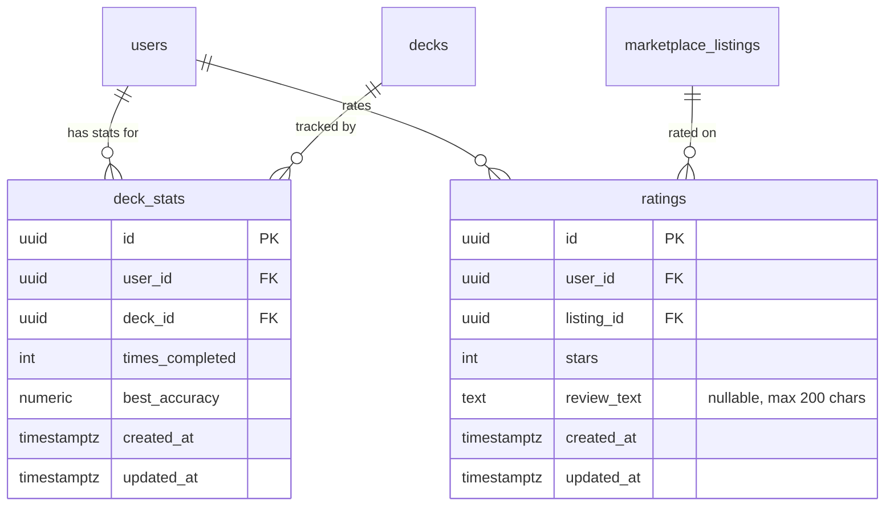

# Deck Rating & Results Screen

## Enhancement Summary

**Deepened on:** 2026-03-13
**Reviewed on:** 2026-03-14 (2 rounds, 14 agents total)

### Critical Bugs to Fix (Existing Code)

1. **Rating `ON CONFLICT DO NOTHING` silently returns 201 on duplicates** — `ratings.js:54` inserts with `ON CONFLICT DO NOTHING` but always returns 201 and runs the `average_rating` UPDATE regardless, double-counting ratings. Fix: check `insertResult.rows.length === 0` and return 409 Conflict. Keep existing transaction wrapper.
2. **Empty `catch {}` swallows errors** — `Study.jsx:119` silently catches session completion errors. Fix: add `toast.error()` and do NOT fall through to `setPhase('results')` on failure.
3. **Client-supplied `correct`/`totalCards` not validated** — `study.js` trusts client values without checking against stored session data. Fix: add a SELECT inside the transaction to fetch stored `total_cards` before the UPDATE, then validate.

---

## Overview

Rework the post-study flow into two distinct screens that replace the current summary phase and rating modal overlay in `Study.jsx`:

1. **Results Screen** — shown after every deck completion. Displays current session accuracy, best accuracy ever, times completed, and an improvement indicator. Powered by a new `deck_stats` table.

2. **Rating Screen** — shown only for purchased decks, only on first completion where they haven't rated yet. Mandatory 1–5 star rating with optional 200-character review text. Rating is final — no edits. Reviews displayed on the marketplace listing page.

## Problem Statement / Motivation

The current flow shows a basic summary with a skippable rating modal overlay. Problems:

- Low rating coverage — users skip the modal, so marketplace listings lack social proof
- No meaningful stats — summary only shows current session accuracy, nothing historical
- No review text — star ratings alone give buyers limited signal
- Modal overlay is easy to dismiss accidentally

This redesign makes rating mandatory for purchased decks, separates results from rating into focused screens, and adds historical stats to encourage repeated study.

## Proposed Solution

### Architecture

Three main changes:

1. **New `deck_stats` table** — per-user, per-deck aggregate stats updated atomically via UPSERT on session completion. Extensible for future metrics.
2. **Modified study completion flow** — `PATCH /api/study/:id` upserts `deck_stats` and returns stats for the results screen, plus whether the user has already rated.
3. **New Study.jsx phases** — replace `'summary'` with `'results'` and add `'rating'` phase. Remove the `RatingModal` overlay entirely.

### Flow

```
Study all cards → PATCH /api/study/:id (upserts deck_stats) →
  Results Screen (always) →
    "Study Again" → restart (re-shuffle cards)
    "Continue" / "Rate this deck" →
      if purchased deck + not yet rated → Rating Screen → submit → Dashboard
      else → Dashboard
```

**Pattern note:** The `deck_stats` UPSERT uses `DO UPDATE` (accumulate stats), which is intentionally different from the `DO NOTHING` pattern in `purchase.js` (deduplicate). Document this distinction in comments.

## Data Changes

### Migration 007: `deck_stats` table + `review_text` column + review flagging

**Note:** Migration 006 (seller terms) must exist and be applied first. If 006 is not yet created, either create it first or renumber this migration to 006.

```sql
-- 007_deck_stats_and_reviews.sql

-- Per-user, per-deck aggregate stats
CREATE TABLE deck_stats (
  id UUID PRIMARY KEY DEFAULT gen_random_uuid(),
  user_id UUID NOT NULL REFERENCES users(id) ON DELETE CASCADE,
  deck_id UUID NOT NULL REFERENCES decks(id) ON DELETE CASCADE,
  times_completed INT NOT NULL DEFAULT 0 CHECK (times_completed >= 0),
  best_accuracy NUMERIC(5,2) NOT NULL DEFAULT 0 CHECK (best_accuracy >= 0 AND best_accuracy <= 100),
  created_at TIMESTAMPTZ NOT NULL DEFAULT NOW(),
  updated_at TIMESTAMPTZ NOT NULL DEFAULT NOW(),
  UNIQUE(user_id, deck_id)
);

-- Only need deck_id index — UNIQUE(user_id, deck_id) already creates
-- a composite index that covers user_id lookups
CREATE INDEX idx_deck_stats_deck ON deck_stats (deck_id);

-- Composite index for rating eligibility check (WHERE user_id = $1 AND deck_id = $2)
CREATE INDEX idx_study_sessions_user_deck ON study_sessions (user_id, deck_id);

-- Add review text to ratings with length constraint
ALTER TABLE ratings ADD COLUMN review_text TEXT CHECK (length(review_text) <= 200);

-- Add review flagging support to content_flags
-- Drop existing unique constraint and replace with one that includes flag_type
ALTER TABLE content_flags
  ADD COLUMN flag_type TEXT NOT NULL DEFAULT 'listing' CHECK (flag_type IN ('listing', 'review')),
  ADD COLUMN rating_id UUID REFERENCES ratings(id) ON DELETE SET NULL;

-- Replace UNIQUE constraint to allow same user to flag both listing and review
ALTER TABLE content_flags DROP CONSTRAINT content_flags_listing_id_reporter_id_key;
ALTER TABLE content_flags ADD CONSTRAINT content_flags_listing_reporter_type_key
  UNIQUE(listing_id, reporter_id, flag_type);
```

**CHECK constraint style:** Inline unnamed constraints matching codebase convention.

**UNIQUE constraint change:** The original `UNIQUE(listing_id, reporter_id)` prevented a user from flagging both a listing AND a review on the same listing. The new constraint `UNIQUE(listing_id, reporter_id, flag_type)` allows both.

**ON DELETE SET NULL (not CASCADE):** When a rating is deleted (e.g., admin upholds a review flag), the content_flag record is preserved with `rating_id = NULL` for audit trail purposes.

### ERD



## Technical Approach

### Phase 1: Database & Backend

#### 1.1 Migration `007_deck_stats_and_reviews.sql`

- [x]Create `deck_stats` table with `UNIQUE(user_id, deck_id)` constraint and inline CHECK constraints
- [x]Add `review_text TEXT` column to `ratings` table with inline CHECK on length
- [x]Add index on `deck_id` only (UNIQUE constraint covers `user_id` lookups)
- [x]Add composite index `(user_id, deck_id)` on `study_sessions` for rating eligibility queries
- [x]Add `flag_type TEXT` and `rating_id UUID` columns to `content_flags` (combined ALTER)
- [x]Drop and recreate UNIQUE constraint on `content_flags` to include `flag_type`

**File:** `server/src/db/migrations/007_deck_stats_and_reviews.sql`

#### 1.1b Backfill script for existing study sessions

- [x]Write a one-time SQL script that populates `deck_stats` from existing `study_sessions`
- [x]Clamp `best_accuracy` to 100 with `LEAST()` to handle dirty data where `correct > total_cards`
- [x]Safety check: abort if `deck_stats` already has data
- [x]Run after migration 007, before deploying new code (use `DATABASE_URL_DIRECT`)

```sql
-- backfill_deck_stats.sql (run manually after migration)

DO $$
BEGIN
  IF EXISTS (SELECT 1 FROM deck_stats LIMIT 1) THEN
    RAISE EXCEPTION 'deck_stats already has data. Backfill may overwrite. Aborting.';
  END IF;
END $$;

INSERT INTO deck_stats (user_id, deck_id, times_completed, best_accuracy)
SELECT
  ss.user_id,
  ss.deck_id,
  COUNT(*) AS times_completed,
  COALESCE(LEAST(MAX(ss.correct::numeric / NULLIF(ss.total_cards, 0) * 100), 100), 0) AS best_accuracy
FROM study_sessions ss
WHERE ss.completed_at IS NOT NULL
GROUP BY ss.user_id, ss.deck_id
ON CONFLICT (user_id, deck_id) DO UPDATE SET
  times_completed = EXCLUDED.times_completed,
  best_accuracy = EXCLUDED.best_accuracy,
  updated_at = NOW();
```

**Deployment sequence:** (1) Deploy migration 007 → (2) Run backfill → (3) Verify → (4) Deploy new code.

**File:** `server/src/db/scripts/backfill_deck_stats.sql`

#### 1.2 Modify `PATCH /api/study/:id` — upsert deck_stats + return stats

Current behavior (in `server/src/routes/study.js:33-82`): updates `study_sessions`, increments `study_score`, returns session + deck origin + listing_id.

New behavior — add to the existing transaction:

- [x]Add a SELECT query inside the transaction to fetch stored `total_cards` BEFORE the UPDATE (the existing UPDATE uses client-supplied values, so we need a separate read)
- [x]Validate client-supplied `correct` and `totalCards` against stored `total_cards`
- [x]Compute `accuracy` from `correct / totalCards * 100`
- [x]UPSERT into `deck_stats`: increment `times_completed`, update `best_accuracy` using `GREATEST()`
- [x]After commit, combine deck info + `has_rated` into a **single** LEFT JOIN query
- [x]Return expanded response: `{ session, deck_origin, listing_id, deck_stats: { times_completed, best_accuracy }, has_rated }`
- [x]No changes needed in `api.completeSession` in `api.js` — auto-parses expanded response

```javascript
// Inside the transaction, BEFORE the existing UPDATE:
const sessionCheck = await client.query(
  'SELECT total_cards FROM study_sessions WHERE id = $1 AND user_id = $2 AND completed_at IS NULL',
  [req.params.id, req.userId]
);
if (sessionCheck.rows.length === 0) {
  await client.query('ROLLBACK');
  return res.status(404).json({ error: 'Session not found or already completed' });
}
const storedTotal = sessionCheck.rows[0].total_cards;
if (totalCards !== storedTotal) {
  await client.query('ROLLBACK');
  return res.status(400).json({ error: 'Card count mismatch' });
}
if (correct < 0 || correct > totalCards) {
  await client.query('ROLLBACK');
  return res.status(400).json({ error: 'Invalid correct count' });
}
```

```sql
-- UPSERT pattern inside the transaction (simple RETURNING, no subquery)
INSERT INTO deck_stats (user_id, deck_id, times_completed, best_accuracy)
VALUES ($1, $2, 1, $3)
ON CONFLICT (user_id, deck_id) DO UPDATE SET
  times_completed = deck_stats.times_completed + 1,
  best_accuracy = GREATEST(deck_stats.best_accuracy, EXCLUDED.best_accuracy),
  updated_at = NOW()
RETURNING times_completed, best_accuracy;
```

**Improvement indicator logic (frontend):** Use `times_completed` and `best_accuracy` from the response:
- `times_completed === 1` → "First completion!"
- `currentAccuracy >= bestAccuracy` (and `times_completed > 1`) → "New personal best!"
- Otherwise → just show the stats grid (best accuracy is visible for comparison)

```sql
-- Combined post-commit query (single round-trip)
SELECT d.origin AS deck_origin, d.purchased_from_listing_id AS listing_id,
       (r.id IS NOT NULL) AS has_rated
FROM decks d
LEFT JOIN ratings r ON r.user_id = $1
  AND r.listing_id = d.purchased_from_listing_id
WHERE d.id = $2
```

**File:** `server/src/routes/study.js`

#### 1.3 Modify `POST /api/ratings` — accept review_text + fix existing bugs

Current behavior (in `server/src/routes/ratings.js:8-86`): validates listing, purchase, and session completion. Inserts rating with `ON CONFLICT DO NOTHING`.

Changes:

- [x]Accept optional `review_text` in request body
- [x]Validate `review_text` type: reject non-string values (`typeof !== 'string'`)
- [x]Validate `review_text` length <= 200 characters (use `[...reviewText].length` for accurate codepoint counting with emoji)
- [x]Sanitize `review_text` — trim whitespace, convert empty/whitespace-only to `null`
- [x]Include `review_text` in the INSERT statement
- [x]Keep existing eligibility checks and **transaction wrapper** (`pool.connect()` / `BEGIN` / `COMMIT` / `ROLLBACK`)
- [x]**Fix: Check `insertResult.rows.length` after ON CONFLICT DO NOTHING** — if 0, ROLLBACK and return 409
- [x]**Fix: Only run `average_rating` UPDATE when INSERT actually inserted** — self-correcting `SELECT AVG/COUNT` pattern

```javascript
// Type validation (before transaction)
if (reviewText !== undefined && reviewText !== null && typeof reviewText !== 'string') {
  return res.status(400).json({ error: 'review_text must be a string' });
}
const cleanReviewText = typeof reviewText === 'string' ? reviewText.trim() || null : null;
if (cleanReviewText && [...cleanReviewText].length > 200) {
  return res.status(400).json({ error: 'Review text must be 200 characters or less' });
}

// Inside the existing transaction:
const insertResult = await client.query(
  `INSERT INTO ratings (user_id, listing_id, stars, review_text)
   VALUES ($1, $2, $3, $4)
   ON CONFLICT (user_id, listing_id) DO NOTHING
   RETURNING id`,
  [userId, listingId, stars, cleanReviewText]
);

if (insertResult.rows.length === 0) {
  await client.query('ROLLBACK');
  return res.status(409).json({ error: 'You have already rated this listing' });
}

// Self-correcting average recalculation
await client.query(
  `UPDATE marketplace_listings SET
     average_rating = (SELECT AVG(stars) FROM ratings WHERE listing_id = $1),
     rating_count = (SELECT COUNT(*) FROM ratings WHERE listing_id = $1)
   WHERE id = $1`,
  [listingId]
);

await client.query('COMMIT');
```

**File:** `server/src/routes/ratings.js`

#### 1.4 Modify `GET /api/ratings/listing/:listingId` — include review_text + add LIMIT

- [x]Add `r.review_text` to the SELECT
- [x]Add `LIMIT 50` to prevent unbounded result sets (intentional — only latest 50 shown)
- [x]Response includes review text for marketplace page display

**File:** `server/src/routes/ratings.js`

#### 1.5 Modify `POST /api/marketplace/:id/flag` — accept flag_type + rating_id

Current behavior (in `server/src/routes/marketplace.js`): inserts `listing_id`, `reporter_id`, `reason` with `ON CONFLICT DO NOTHING`.

Changes:

- [x]Accept optional `flag_type` (default `'listing'`) and `rating_id` from request body
- [x]Validate: `flag_type` must be `'listing'` or `'review'`
- [x]When `flag_type === 'review'`: `rating_id` is required, must reference a rating that belongs to this listing
- [x]When `flag_type === 'listing'`: `rating_id` must be null
- [x]Update INSERT to include `flag_type` and `rating_id`
- [x]Update ON CONFLICT target to `(listing_id, reporter_id, flag_type)`

**File:** `server/src/routes/marketplace.js`

#### 1.6 Modify admin flag endpoints — handle review flags

- [x]`GET /api/admin/flags`: LEFT JOIN to `ratings` via `cf.rating_id` to include `r.review_text`, `r.stars` in response
- [x]`PATCH /api/admin/flags/:id`: Include `flag_type` and `rating_id` in RETURNING clause
  - If `flag_type === 'listing'` + uphold: keep existing delist behavior
  - If `flag_type === 'review'` + uphold: delete the rating row (by `rating_id`), recalculate `average_rating`/`rating_count` on the listing. Do NOT delist.
  - If `rating_id IS NULL` on a review flag: treat as error, do not resolve

**File:** `server/src/routes/admin.js`

### Phase 2: Frontend — Study Flow & Dashboard

#### 2.1 Remove `RatingModal` component from Study.jsx

- [x]Delete the `RatingModal` function component (lines 6–72)
- [x]Remove `showRating` and `listingId` state variables
- [x]Remove `{showRating && listingId && <RatingModal ... />}` from summary render

**File:** `client/src/pages/Study.jsx`

#### 2.2 Add new state + refs for results and rating phases

- [x]Add state: `deckStats`, `hasRated`, `reviewText`, `selectedStars`, `hoveredStars`, `isSubmitting`, `isRestarting`
- [x]Add refs: `completingRef`, `submittingRef`, `advanceTimeoutRef`, `advancingRef`
- [x]Change phase values: replace `'summary'` with `'results'`, add `'rating'`

**Note on handleRate signature:** Preserve existing per-card accumulation (`handleRate('correct'|'missed')`), derive counts at completion time.

**File:** `client/src/pages/Study.jsx`

#### 2.3 Update `handleRate` callback — store completion response

- [x]Add `advancingRef` guard to prevent key-repeat skipping cards during 200ms timeout
- [x]Add `completingRef` guard to prevent double-completion on last card
- [x]Derive `correct` and `totalCards` from accumulated `newResults` at completion time
- [x]Store full response from `api.completeSession()` including `deck_stats` and `has_rated`
- [x]Set phase to `'results'` only inside `try` block
- [x]**Fix: Replace empty `catch {}` with `toast.error()`, reset `completingRef`**
- [x]Clean up `advanceTimeoutRef` on unmount

```javascript
const completingRef = useRef(false);
const advancingRef = useRef(false);
const advanceTimeoutRef = useRef(null);

const handleRate = useCallback(async (rating) => {
  if (advancingRef.current) return; // Block input during card transition

  const newResults = [...results, rating];
  setResults(newResults);

  if (newResults.length < cards.length) {
    // Not the last card — advance with input lock
    advancingRef.current = true;
    setFlipped(false);
    advanceTimeoutRef.current = setTimeout(() => {
      setCurrentIndex((i) => i + 1);
      advancingRef.current = false;
    }, 200);
    return;
  }

  // Last card — complete session
  if (completingRef.current) return;
  completingRef.current = true;

  const correct = newResults.filter(r => r === 'correct').length;
  const totalCards = cards.length;

  try {
    const res = await api.completeSession(sessionId, correct, totalCards);
    setDeckStats(res.deck_stats);
    setHasRated(res.has_rated);
    setListingId(res.listing_id);
    setPhase('results');
  } catch (err) {
    toast.error('Failed to save results. Please try again.');
    completingRef.current = false;
  }
}, [results, cards, sessionId]);

// Cleanup timeout on unmount
useEffect(() => {
  return () => {
    if (advanceTimeoutRef.current) clearTimeout(advanceTimeoutRef.current);
  };
}, []);
```

**File:** `client/src/pages/Study.jsx`

#### 2.4 Build Results Screen (replaces summary phase)

- [x]Show deck title
- [x]Show stats grid: cards correct/total, current accuracy %, best accuracy %, times completed
- [x]Improvement indicator (2 states):
  - `times_completed === 1` → "First completion!"
  - `currentAccuracy >= bestAccuracy` (and `times_completed > 1`) → "New personal best!"
  - Otherwise → no indicator (stats grid shows both values for self-comparison)
- [x]Keep progress bar
- [x]Buttons (disable both while `isRestarting`):
  - "Study Again" — await startSession, re-shuffle cards, reset state
  - Dynamic label: "Rate this deck" if purchased + not rated, "Continue" otherwise

```javascript
const [isRestarting, setIsRestarting] = useState(false);

const handleStudyAgain = async () => {
  if (isRestarting) return;
  setIsRestarting(true);
  // Clear any pending advance timeout
  if (advanceTimeoutRef.current) {
    clearTimeout(advanceTimeoutRef.current);
    advanceTimeoutRef.current = null;
  }
  try {
    const res = await api.startSession(deckId);
    setSessionId(res.session.id);
    setCurrentIndex(0);
    setResults([]);
    setFlipped(false);
    setCards((prev) => [...prev].sort(() => Math.random() - 0.5)); // Re-shuffle
    setPhase('studying');
    completingRef.current = false;
    advancingRef.current = false;
  } catch (err) {
    toast.error('Failed to start new session');
  } finally {
    setIsRestarting(false);
  }
};
```

**File:** `client/src/pages/Study.jsx`

#### 2.5 Build Rating Screen (new phase)

- [x]Full-screen layout matching study dark theme
- [x]Show deck title and card count for context
- [x]1–5 star selector (reuse star SVG from old RatingModal). `aria-label` on each button. Tab navigation sufficient.
- [x]Optional review text: `<textarea>` with 200-char max, counter "X/200" — neutral by default, red at 200
- [x]**Submit guard: `submittingRef` (useRef) for synchronous guard + `isSubmitting` (useState) for UI**
- [x]Warning text: "This rating is final and cannot be changed"
- [x]No skip/back button
- [x]On submit → toast success → `navigate('/dashboard', { replace: true })`
- [x]On error → toast error, reset ref + state, stay on screen
- [x]Verify `<Toaster>` is at app level (survives route change)

```javascript
const submittingRef = useRef(false);
const [isSubmitting, setIsSubmitting] = useState(false);

const handleSubmitRating = async () => {
  if (submittingRef.current) return;
  submittingRef.current = true;
  setIsSubmitting(true);
  try {
    await api.submitRating(listingId, selectedStars, reviewText.trim() || null);
    toast.success('Rating submitted!');
    navigate('/dashboard', { replace: true });
  } catch (err) {
    toast.error(err.message || 'Failed to submit rating');
    submittingRef.current = false;
    setIsSubmitting(false);
  }
};
```

**File:** `client/src/pages/Study.jsx`

#### 2.6 Update `api.submitRating` to accept review_text

- [x]Change signature: `submitRating: (listingId, stars, reviewText)`
- [x]Include `reviewText` in the JSON body

**File:** `client/src/lib/api.js`

#### 2.7 Update `api.flagListing` to accept flag_type + rating_id

- [x]Change signature: `flagListing: (listingId, reason, flagType, ratingId)`
- [x]Include `flag_type` and `rating_id` in the JSON body (default `flag_type` to `'listing'`)

**File:** `client/src/lib/api.js`

#### 2.8 Show "Rated" badge on Dashboard

- [x]Add LEFT JOIN to `ratings` in GET `/api/decks` query
- [x]**Update GROUP BY to include `rt.id`**
- [x]Return `has_rated` boolean: `(rt.id IS NOT NULL) AS has_rated`

```sql
LEFT JOIN ratings rt ON rt.user_id = d.user_id
  AND rt.listing_id = d.purchased_from_listing_id
-- GROUP BY: add rt.id
GROUP BY d.id, ml.id, ml.status, rt.id
```

- [x]Add "Rated" badge next to "Purchased" badge when `deck.has_rated` is true
- [x]Badge style: `px-1.5 py-0.5 bg-[#C8A84E]/10 text-[#C8A84E] text-xs font-medium rounded`

**Files:** `server/src/routes/decks.js`, `client/src/pages/Dashboard.jsx`

### Phase 3: Marketplace Reviews & Review Flagging

#### 3.1 Add reviews section to MarketplaceDeck page

- [x]Fetch ratings using `Promise.all` with existing listing fetch:

```javascript
useEffect(() => {
  Promise.all([api.getListing(id), api.getListingRatings(id)])
    .then(([listingData, ratingsData]) => {
      setData(listingData);
      setRatings(ratingsData.ratings || []);
    })
    .catch((err) => toast.error(err.message))
    .finally(() => setLoading(false));
}, [id]);
```

- [x]Add "Reviews" section below sample cards
- [x]Only show reviews with `review_text` (star-only ratings contribute to average but don't appear)
- [x]Each review card: gold stars, display name, review text (React text content only — **never** `dangerouslySetInnerHTML`), date
- [x]If no reviews with text exist, don't show the reviews section

**File:** `client/src/pages/MarketplaceDeck.jsx`

#### 3.2 Add review flagging

- [x]Add "Report" link under each review
- [x]Modify `ReportModal` to accept optional `flagType` and `ratingId` props
- [x]When reporting a review: pass `flag_type: 'review'` and `rating_id` to `api.flagListing`
- [x]When reporting a listing: pass `flag_type: 'listing'` (existing behavior, default)

**File:** `client/src/pages/MarketplaceDeck.jsx`

## Acceptance Criteria

### Functional Requirements

- [x]After studying all cards, Results Screen is shown (not the old summary)
- [x]Results Screen shows: cards correct/total, current accuracy %, best accuracy %, times completed, improvement indicator
- [x]"Study Again" button restarts the session (awaits API, re-shuffles cards)
- [x]Both "Study Again" and "Continue" buttons disabled while either async operation is in flight
- [x]"Continue"/"Rate this deck" button goes to Rating Screen for eligible purchased decks, or dashboard otherwise
- [x]Rating Screen is full-screen (not a modal overlay)
- [x]Rating Screen requires 1–5 star selection before submit is enabled
- [x]Rating Screen allows optional review text (max 200 characters with counter, 2-state color)
- [x]Warning text "This rating is final and cannot be changed" is displayed
- [x]No skip or back button on Rating Screen
- [x]After submitting rating, user navigates to dashboard (with `replace: true`)
- [x]Rating Screen only appears once per purchased deck (subsequent completions skip it)
- [x]`deck_stats` tracks `times_completed` and `best_accuracy` per user per deck
- [x]`best_accuracy` only increases (uses `GREATEST()`)
- [x]Reviews with text appear on MarketplaceDeck page below sample cards
- [x]Star-only ratings contribute to average but don't appear as reviews
- [x]Purchased deck cards on Dashboard show "Rated" badge after rating
- [x]Reviews can be flagged — admin uphold removes review (does NOT delist listing)
- [x]Double-completion prevented via `completingRef` (useRef) guard
- [x]Double-rating-submission prevented via `submittingRef` (useRef) + `isSubmitting` (useState) combo
- [x]Existing rating duplicate bug fixed (409 on duplicate, no double-counting)
- [x]Review text never rendered via `dangerouslySetInnerHTML` or `innerHTML`
- [x]Keyboard input locked during 200ms card advance via `advancingRef`

### Non-Functional Requirements

- [x]`deck_stats` UPSERT is atomic (inside the session completion transaction)
- [x]`review_text` validated server-side: type check, codepoint length (`[...text].length`), CHECK constraint, whitespace trim
- [x]`best_accuracy` constrained to 0–100 range (CHECK constraint)
- [x]Client-supplied `correct`/`totalCards` validated via separate SELECT **before** UPDATE/UPSERT
- [x]No breaking changes to existing study flow for non-purchased decks
- [x]Rating screen handles network errors gracefully (toast error, stay on screen)
- [x]Backfill script populates `deck_stats` with `LEAST(..., 100)` clamp
- [x]Empty `catch {}` replaced with proper error handling
- [x]Card advance setTimeout cleaned up on unmount
- [x]Ratings listing endpoint has `LIMIT 50`
- [x]MarketplaceDeck uses `Promise.all` for parallel API calls
- [x]`<Toaster>` mounted at app level
- [x]Review flag UNIQUE constraint allows mixed flag types from same user/listing
- [x]Deleted ratings preserve flag audit trail via `ON DELETE SET NULL`

## Dependencies & Prerequisites

- Migration 006 (seller terms) must exist and be applied first
- Existing `ratings` table with `UNIQUE(user_id, listing_id)` constraint
- Existing `content_flags` table and admin endpoints
- Backfill script must run after migration 007 but before new code is deployed

## References

### Internal References

- Brainstorm: `docs/brainstorms/2026-03-13-deck-rating-and-results-screen-brainstorm.md`
- Study flow: `client/src/pages/Study.jsx` (current RatingModal + summary phase)
- Study routes: `server/src/routes/study.js` (session start/complete/stats)
- Ratings routes: `server/src/routes/ratings.js` (submit + list ratings)
- Flag endpoint: `server/src/routes/marketplace.js` (POST /:id/flag)
- Marketplace page: `client/src/pages/MarketplaceDeck.jsx` (listing detail + ReportModal)
- Dashboard: `client/src/pages/Dashboard.jsx` (deck cards with badges)
- API client: `client/src/lib/api.js` (submitRating, flagListing — completeSession needs no changes)
- Admin flags: `server/src/routes/admin.js` (flag resolution endpoints)
- Ratings migration: `server/src/db/migrations/004_ratings_and_flags.sql`

### Patterns to Follow

- **Inline modal pattern**: ReportModal in MarketplaceDeck.jsx, SellerTermsModal in Dashboard.jsx
- **Star SVG**: Reuse from existing RatingModal (`Study.jsx:41-48`)
- **Dark study theme**: `bg-gradient-to-br from-[#1A1614] via-[#0d4a3d] to-[#1A1614]`
- **Gold accent**: `text-[#C8A84E]` for stars and rating badges
- **Toast pattern**: `react-hot-toast` (dark style, top-right)
- **UPSERT pattern**: `DO UPDATE` here (accumulating), vs `DO NOTHING` in purchase.js (deduplicating)
- **LEFT JOIN pattern**: For optional data in queries (matches decks.js)
- **Ref guard**: `useRef` for synchronous double-click prevention; pair with `useState` for UI
- **Transaction pattern**: `pool.connect()` / `BEGIN` / `COMMIT` / `ROLLBACK`
- **Inline CHECK**: `CHECK (expr)` without `CONSTRAINT name`
- **handleRate signature**: Per-card accumulation, derive counts at completion
- **Card shuffle**: Re-shuffle on "Study Again" with `[...prev].sort(() => Math.random() - 0.5)`
