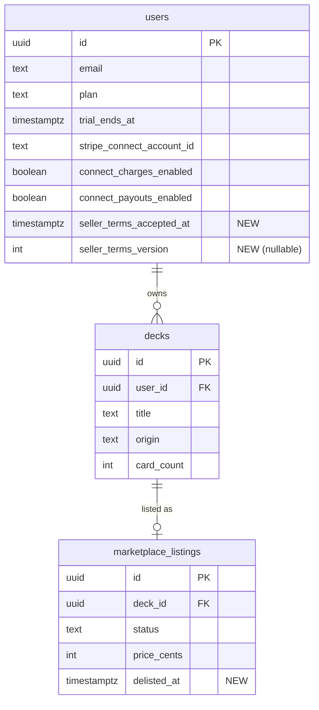

<!-- FINISHED -->

# Seller Onboarding Flow & Dashboard Marketplace Listing

## Overview

Build a complete seller journey: explicit opt-in to become a seller (separate from Pro), a content liability/terms acceptance step, and a visible way to list decks directly from the Dashboard. Currently the `ListDeck` page exists at `/sell/:deckId` but is unreachable — no UI links to it.

Three connected features:

1. **Seller opt-in flow** with dual entry points (post-checkout prompt + Settings)
2. **Seller terms/liability agreement** modal before Stripe Connect onboarding
3. **Status-aware sell icon** on each Dashboard deck card

**Source brainstorm:** `docs/brainstorms/2026-03-13-seller-flow-brainstorm.md`

## Problem Statement / Motivation

Pro users currently have no clear path to become sellers. The Stripe Connect onboarding and listing form exist but are effectively hidden — the only way to reach them is by manually navigating to `/seller` or typing `/sell/:deckId` in the URL bar. There is also no content liability agreement, leaving the platform exposed if a seller lists harmful or copyrighted content.

## Proposed Solution

### Seller Onboarding Flow

```
Pro Checkout Success
        │
        ▼
 ┌──────────────┐     ┌──────────────┐     ┌──────────────┐     ┌──────────────┐
 │  Post-Checkout│     │  Seller Terms│     │ Stripe Connect│     │   Active     │
 │  Seller Prompt│────▶│  Modal       │────▶│ Onboarding   │────▶│   Seller     │
 │  (banner)     │     │  (checkbox)  │     │ (Express)    │     │              │
 └──────┬───────┘     └──────────────┘     └──────────────┘     └──────────────┘
        │ skip                                                          │
        ▼                                                               ▼
 ┌──────────────┐                                              ┌──────────────┐
 │  Settings:   │─── "Become a Seller" ──────────────────────▶ │  Dashboard   │
 │  Seller      │                                              │  Sell Icons  │
 │  Section     │                                              │  Appear      │
 └──────────────┘                                              └──────────────┘
```

### Dashboard Sell Icon States

| Deck State                                                  | Icon        | Behavior                              |
| ----------------------------------------------------------- | ----------- | ------------------------------------- |
| Eligible (generated, 10+ cards, not listed, user is seller) | "Sell"      | Clickable → `/sell/:deckId`           |
| Ineligible (purchased, <10 cards, or not a seller)          | Greyed icon | Not clickable                         |
| Active listing                                              | "View"      | Clickable → `/marketplace/:listingId` |
| Delisted listing                                            | "Relist"    | Clickable → calls relist endpoint     |

## Technical Approach

### Database Changes (ERD)



### Implementation Phases

#### Phase 1: Database & Backend Foundation

**Migration 006** — Add seller terms columns to `users` table and `delisted_at` to `marketplace_listings`.

`server/src/db/migrations/006_seller_terms.sql`:

```sql
ALTER TABLE users
  ADD COLUMN seller_terms_accepted_at TIMESTAMPTZ,
  ADD COLUMN seller_terms_version INT;

ALTER TABLE marketplace_listings
  ADD COLUMN delisted_at TIMESTAMPTZ;
```

Notes:

- `seller_terms_version` is nullable — `NULL` means never accepted, a value (e.g. `1`) means accepted that version. Only set alongside `seller_terms_accepted_at` via the accept-terms endpoint.
- `delisted_at` tracks when a listing was delisted, separate from `updated_at` which changes on any modification (price, description, etc.).

**New endpoint: `POST /api/seller/accept-terms`** in `server/src/routes/seller.js`:

- Middleware chain: `authenticate → checkTrialExpiry → requirePlan('pro')`
- Sets `seller_terms_accepted_at = NOW()`, `seller_terms_version = 1`
- Idempotent: if already set, returns 200 with existing timestamp
- Returns `{ seller_terms_accepted_at, seller_terms_version }`

**Gate seller endpoints on terms acceptance:**

Add a terms-acceptance check to three endpoints in `server/src/routes/seller.js`:

1. **`POST /api/seller/onboard`** — if `seller_terms_accepted_at IS NULL`, return 403 with `{ error: 'terms_required', message: 'You must accept seller terms before connecting Stripe.' }`
2. **`POST /api/seller/listings`** (create listing) — same 403 check. Currently only gates on `connect_charges_enabled` (line 74-79); add `seller_terms_accepted_at` to the query and check both.
3. **`POST /api/seller/listings/:id/relist`** (relist) — same 403 check. Currently only gates on `connect_charges_enabled` (line 217-221); add `seller_terms_accepted_at` to the query and check both.

Pattern for all three:

```javascript
const { rows: userRows } = await pool.query('SELECT connect_charges_enabled, seller_terms_accepted_at FROM users WHERE id = $1', [req.userId]);
if (!userRows[0].seller_terms_accepted_at) {
  return res.status(403).json({ error: 'terms_required', message: 'You must accept seller terms first.' });
}
if (!userRows[0].connect_charges_enabled) {
  return res.status(403).json({ error: 'Complete Stripe Connect onboarding before listing decks' });
}
```

**Update `GET /api/decks`** in `server/src/routes/decks.js`:

- LEFT JOIN `marketplace_listings` on `deck_id` to return `listing_id` and `listing_status` per deck
- Query change:

```sql
SELECT d.*, COUNT(c.id) AS card_count,
       ml.id AS listing_id, ml.status AS listing_status
FROM decks d
LEFT JOIN cards c ON c.deck_id = d.id
LEFT JOIN marketplace_listings ml ON ml.deck_id = d.id
WHERE d.user_id = $1
GROUP BY d.id, ml.id, ml.status
ORDER BY d.created_at DESC
```

**Update `sanitizeUser` and `USER_SELECT`** in `server/src/routes/auth.js`:

- Add `seller_terms_accepted_at` and `connect_payouts_enabled` to both so the client knows full seller status
- `connect_payouts_enabled` is needed by Settings (Phase 4) to distinguish "Finish Stripe Setup" from "Active Seller" states

**Update delist endpoint** in `server/src/routes/seller.js`:

- `DELETE /api/seller/listings/:id` (line 196-212) — set `delisted_at = NOW()` alongside `status = 'delisted'`:

```sql
UPDATE marketplace_listings SET status = 'delisted', delisted_at = NOW(), updated_at = NOW()
WHERE id = $1 AND seller_id = $2 AND status = 'active'
```

**Files:**

- `server/src/db/migrations/006_seller_terms.sql` (new)
- `server/src/routes/seller.js` — new accept-terms endpoint, terms gate on onboard/create/relist, delist sets `delisted_at`
- `server/src/routes/decks.js` — LEFT JOIN for listing data
- `server/src/routes/auth.js` — expose `seller_terms_accepted_at` and `connect_payouts_enabled`

---

#### Phase 2: Seller Terms Modal (Frontend)

**SellerTermsModal component** — inline in Dashboard.jsx (following existing ReportModal / RatingModal pattern).

Props: `{ onAccept, onClose }`

Content:

- Title: "Become a Seller"
- Subtitle: "Before you start selling, please review and accept the following:"
- Bullet points:
  - You are responsible for all content you list, including AI-generated content
  - Review your full deck before listing — make sure it's accurate and complete
  - Clean, well-organized notecards sell better and get higher ratings
  - We reserve the right to remove listings that violate our content guidelines
- Checkbox: "I understand and agree"
- Buttons: "Continue" (disabled until checked) / "Cancel"

On accept:

1. Call `POST /api/seller/accept-terms`
2. Call `refreshUser()` to update AuthContext
3. Call `api.startSellerOnboarding()` to get Stripe Connect URL
4. Redirect to Stripe Connect

**API client additions** in `client/src/lib/api.js`:

```javascript
acceptSellerTerms: () => request('/seller/accept-terms', { method: 'POST' }),
relistListing: (id) => request(`/seller/listings/${id}/relist`, { method: 'POST' }),
```

Note: `relistListing` is needed by Phase 5 (Dashboard sell icons) for the "Relist" action. Adding it here alongside `acceptSellerTerms` keeps all new API methods in one phase.

**Modal styling** — follow established pattern:

- Overlay: `fixed inset-0 bg-black/50 flex items-center justify-center z-50 p-4`
- Dialog: `bg-white rounded-2xl p-6 max-w-md w-full` (slightly wider than ReportModal for readability)

**Files:**

- `client/src/pages/Dashboard.jsx` — add SellerTermsModal component
- `client/src/lib/api.js` — add `acceptSellerTerms` method

---

#### Phase 3: Post-Checkout Seller Prompt (Dashboard)

**Inline banner** on Dashboard, triggered when `?upgraded=true` is in the URL AND `user.plan === 'pro'` after `refreshUser()`.

Design: similar to the existing trial banner but with seller CTA.

```
┌─────────────────────────────────────────────────────────────────┐
│  🎉 Welcome to Pro!                                            │
│  Want to sell your flashcard decks on the marketplace?          │
│  You can skip this and become a seller later in Settings.       │
│                                                                 │
│  [Become a Seller]                              [Skip for now]  │
└─────────────────────────────────────────────────────────────────┘
```

**Behavior:**

- "Become a Seller" → opens SellerTermsModal
- "Skip for now" → dismisses banner
- Clean URL after showing: `window.history.replaceState({}, '', '/dashboard')` to prevent re-display on refresh
- Only render when `user.plan === 'pro'` (handles webhook delay — if plan isn't updated yet, user gets the toast but not the seller prompt; they can use Settings later)

**Files:**

- `client/src/pages/Dashboard.jsx` — new banner component + state management

---

#### Phase 4: Settings "Become a Seller" Section

Add a third `<section>` block in Settings.jsx after the Subscription section.

**Visibility logic:**

| User State                                                                           | Section Shows                              |
| ------------------------------------------------------------------------------------ | ------------------------------------------ |
| Not Pro                                                                              | Hidden                                     |
| Pro, not a seller (`seller_terms_accepted_at` null, `connect_charges_enabled` false) | "Become a Seller" CTA                      |
| Pro, terms accepted but Connect incomplete                                           | "Finish Stripe Setup" CTA                  |
| Pro, active seller                                                                   | "Active Seller" status + link to `/seller` |

**"Become a Seller" CTA:**

- Brief description: "Earn money by selling your flashcard decks on the marketplace."
- Button: "Become a Seller" → opens SellerTermsModal
- Note: same modal component defined in Dashboard.jsx — extract to a shared inline pattern or duplicate (both follow codebase convention of inline modals)

Since the app uses inline modal components per page (not shared components), the SellerTermsModal will be duplicated in Settings.jsx. This follows the established ReportModal/RatingModal pattern.

**Files:**

- `client/src/pages/Settings.jsx` — new seller section + SellerTermsModal copy

---

#### Phase 5: Dashboard Sell Icons

Add a status-aware icon/badge in the **top-right corner** of each deck card in Dashboard.jsx.

**Data required per deck** (from updated GET `/api/decks`):

- `origin` — already returned
- `card_count` — already returned
- `listing_id` — new (from LEFT JOIN)
- `listing_status` — new (from LEFT JOIN)

**User data required:**

- `connect_charges_enabled` — already in AuthContext
- `seller_terms_accepted_at` — new (added in Phase 1)

**Icon logic:**

```javascript
function getDeckSellState(deck, user) {
  const isSeller = user.connect_charges_enabled && user.seller_terms_accepted_at;

  if (deck.listing_id && deck.listing_status === 'active') return 'view';
  if (deck.listing_id && deck.listing_status === 'delisted') return 'relist';
  if (!isSeller) return 'disabled';
  if (deck.origin === 'purchased') return 'disabled';
  if (deck.card_count < 10) return 'disabled';
  return 'sell';
}
```

**Rendering:**

| State      | Visual                               | Click Action                                             |
| ---------- | ------------------------------------ | -------------------------------------------------------- |
| `sell`     | Green price-tag icon + "Sell" text   | Navigate to `/sell/${deck.id}`                           |
| `view`     | Green price-tag icon + "View" text   | Navigate to `/marketplace/${deck.listing_id}`            |
| `relist`   | Green price-tag icon + "Relist" text | Call `api.relistListing(deck.listing_id)`, refresh decks |
| `disabled` | Grey price-tag icon, no text         | Not clickable, `cursor-not-allowed opacity-40`           |

Icon placement: `absolute top-3 right-3` inside the deck card (card needs `relative` positioning).

**Files:**

- `client/src/pages/Dashboard.jsx` — sell icon rendering + state logic

---

#### Phase 6: Bug Fixes & Cleanup

**6a. Fix `account.application.deauthorized` webhook bug** in `server/src/index.js`:

- Current code (lines 101-116) nullifies `stripe_connect_account_id` THEN tries to delist by that ID (finds zero rows because the subquery `SELECT id FROM users WHERE stripe_connect_account_id = $1` returns nothing)
- Fix: use a single CTE query that delists first, then nullifies — both in one atomic operation

```sql
WITH delisted AS (
  UPDATE marketplace_listings SET status = 'delisted', delisted_at = NOW(), updated_at = NOW()
  WHERE seller_id = (SELECT id FROM users WHERE stripe_connect_account_id = $1)
    AND status = 'active'
)
UPDATE users SET stripe_connect_account_id = NULL,
  connect_charges_enabled = false, connect_payouts_enabled = false
WHERE stripe_connect_account_id = $1;
```

**6b. Fix fee split discrepancy:**

- SellerDashboard.jsx line 83 says "50% of every sale"
- ListDeck.jsx line 58 calculates 50% platform fee (seller gets 50%)
- purchase.js line 69 calculates `Math.round(listing.price_cents * 0.3)` as `application_fee_amount`
- **Action:** Verify intended split with product owner. Update all references to match. Last commit message (`f394c2d`) mentions "update seller split to 50%". If 50/50 is correct:
  - Update `purchase.js` to use `0.5` instead of `0.3`
  - Update `ListDeck.jsx` fee calculation to `0.5`
  - SellerDashboard.jsx text is already correct

**6c. Add client-side guard to ListDeck.jsx:**

- On mount, check `user.connect_charges_enabled` and `user.seller_terms_accepted_at`
- If not eligible, redirect to `/seller` with toast: "Complete seller setup to list decks"

**6d. Handle `connect=refresh` in SellerDashboard.jsx:**

- Currently ignored. Add handler: when `connect=refresh` is detected, show toast "Your Stripe link expired. Click below to try again." and ensure the CTA is visible.

**6e. Dashboard delete warning for listed decks:**

- Update `handleDelete` confirm message: if deck has `listing_id`, warn "This deck has an active marketplace listing. Deleting it will also remove the listing and sales history."

**6f. Remove dead code in `server/src/services/purchase.js`:**

- Lines 178-182 build a batch insert `values` array that is never used (individual inserts follow on lines 184-189). Remove the dead `values` variable.

**Files:**

- `server/src/index.js` — webhook fix (CTE)
- `server/src/services/purchase.js` — fee split (if changing to 50/50) + dead code cleanup
- `client/src/pages/ListDeck.jsx` — fee calc + seller guard
- `client/src/pages/SellerDashboard.jsx` — refresh handling
- `client/src/pages/Dashboard.jsx` — delete warning

## Acceptance Criteria

### Functional Requirements

- [x] Pro users see a seller prompt banner after successful checkout on Dashboard
- [x] Prompt can be skipped with note about Settings access
- [x] Prompt does not reappear on page refresh (URL cleaned)
- [x] Settings page shows "Become a Seller" section for Pro users who are not sellers
- [x] Settings section shows "Active Seller" status for active sellers
- [x] Settings section shows "Finish Stripe Setup" for users who accepted terms but haven't completed Connect
- [x] Seller terms modal displays 4 liability/quality bullet points with checkbox
- [x] Terms acceptance is recorded in database (`seller_terms_accepted_at`)
- [x] Stripe Connect onboarding is gated on terms acceptance (server-side)
- [x] Dashboard deck cards show sell icon in top-right corner
- [x] Sell icon shows "Sell" for eligible decks (generated, 10+ cards, not listed)
- [x] Sell icon is greyed out for ineligible decks (purchased, <10 cards, or not a seller)
- [x] Sell icon shows "View" for decks with active marketplace listings
- [x] Sell icon shows "Relist" for decks with delisted listings
- [x] Clicking "Sell" navigates to `/sell/:deckId`
- [x] Clicking "View" navigates to `/marketplace/:listingId`
- [x] Clicking "Relist" relists the deck and refreshes the Dashboard
- [x] Trial users cannot access any seller features
- [x] Direct URL access to `/sell/:deckId` redirects non-sellers to `/seller`

### Non-Functional Requirements

- [x] Fee split is consistent across all code paths and UI text
- [x] `account.application.deauthorized` webhook correctly delists before nullifying (single CTE query)
- [x] Dashboard delete warns about active marketplace listings
- [x] `connect=refresh` is handled in SellerDashboard with user-friendly message
- [x] Seller terms acceptance gates all seller write endpoints: onboard, create listing, relist
- [x] `seller_terms_version` is nullable — `NULL` means never accepted, integer means accepted that version
- [x] `delisted_at` column tracks delist timestamps separately from `updated_at`
- [x] `connect_payouts_enabled` and `seller_terms_accepted_at` exposed via `sanitizeUser`/`USER_SELECT`
- [x] `relistListing` API client method exists in `api.js`
- [x] Dead code removed from `purchase.js` (unused batch insert values array)

## Dependencies & Prerequisites

- Stripe Connect Express is already fully implemented (onboarding, webhooks, payouts)
- ListDeck page at `/sell/:deckId` already exists with full listing form
- SellerDashboard at `/seller` already handles connected vs. non-connected states
- Modal patterns established by ReportModal and RatingModal
- Settings page has clear section structure for adding new blocks

## Risk Analysis & Mitigation

| Risk                                                               | Impact                     | Mitigation                                                               |
| ------------------------------------------------------------------ | -------------------------- | ------------------------------------------------------------------------ |
| Webhook delay after checkout — user arrives before plan is updated | Seller prompt doesn't show | Only show prompt when `user.plan === 'pro'` confirmed; Settings fallback |
| User accepts terms but abandons Stripe Connect                     | Stuck in limbo state       | Settings shows "Finish Stripe Setup" CTA; no data loss                   |
| Concurrent onboarding from two tabs                                | Duplicate Stripe accounts  | Server reuses existing `stripe_connect_account_id` — already handled     |
| Fee split confusion across docs and implementation                 | Incorrect payouts          | Resolve before implementation; update all references atomically          |
| Terms change in the future                                         | Compliance gap             | `seller_terms_version` column allows tracking which version was accepted |

## References & Research

### Internal References

- Brainstorm: `docs/brainstorms/2026-03-13-seller-flow-brainstorm.md`
- Marketplace plan: `docs/plans/2026-03-12-feat-marketplace-production-readiness-plan.md`
- Auth guide: `docs/solutions/auth-implementation-guide.md`
- Modal patterns: `client/src/pages/MarketplaceDeck.jsx:33-89` (ReportModal), `client/src/pages/Study.jsx:6-72` (RatingModal)
- Settings layout: `client/src/pages/Settings.jsx`
- Dashboard deck cards: `client/src/pages/Dashboard.jsx:145-195`
- Seller routes: `server/src/routes/seller.js`
- Decks query: `server/src/routes/decks.js:10-18`
- User sanitization: `server/src/routes/auth.js:25-42`
- Deauthorize webhook bug: `server/src/index.js:101-116`
- Fee calculation: `server/src/services/purchase.js:69`, `client/src/pages/ListDeck.jsx:58`
- Fee fulfillment: `server/src/services/purchase.js:139` (duplicate 0.3 multiplier)
- Dead code: `server/src/services/purchase.js:178-182` (unused batch insert values array)
- Seller create listing gate: `server/src/routes/seller.js:74-79`
- Seller relist gate: `server/src/routes/seller.js:217-221`
- Seller delist endpoint: `server/src/routes/seller.js:196-212`
- Marketplace listings schema: `server/src/db/migrations/003_marketplace.sql:27-45`
- API client methods: `client/src/lib/api.js:80-87`
