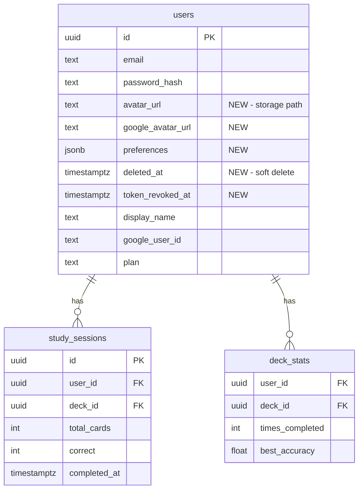

# Account & Settings Experience

## Enhancement Summary

**Deepened on:** 2026-03-14
**Research agents used:** 11 (frontend-design, security-sentinel, performance-oracle, architecture-strategist, code-simplicity-reviewer, frontend-races-reviewer, data-integrity-guardian, pattern-recognition-specialist, best-practices-researcher, framework-docs-researcher, learnings-researcher)

### Key Improvements

1. **BLOCKER: Account deletion requires soft-delete** — `purchases` table FK constraints (seller_id, listing_id) use RESTRICT, not CASCADE. Hard `DELETE FROM users` will fail for any user who has sold or bought decks. Must use `deleted_at` soft-delete column instead.
2. **Avatar upload security hardened** — Must validate file content via magic-byte detection (`fileTypeFromBuffer`), not just `file.mimetype` which is client-supplied and spoofable. Existing pattern at `generate.js:67-79`.
3. **sanitizeUser is an explicit allowlist** — Every new field must be manually added. Must expose `has_password` (boolean, not the hash), `google_connected` (boolean), and resolved `avatar_url` (with Google fallback) as derived fields.
4. **Study history must use cursor pagination** — OFFSET pagination degrades at scale. Use `completed_at` cursor with composite index `(user_id, completed_at DESC)`.
5. **Click-outside dropdown must use `mousedown`** — Using `click` causes a toggle-bounce race condition where clicking the button registers as both a click-outside and a toggle.
6. **Profile data loading uses `Promise.allSettled`** — Partial failure resilience so stats can render even if history fails.
7. **Preferences auto-save needs debounce+serialize** — Rapid toggle changes must be debounced (300ms) and serialized (no concurrent PATCH requests).

### New Considerations Discovered

- `token_revoked_at` column was designed but never migrated — must be added in migration 008
- `requireXHR` must be extracted from `generate.js` to shared `middleware/csrf.js` — not duplicated
- Store avatar as storage path (`avatars/{userId}.{ext}`) not full URL — with cache-busting `?v=` param
- Export uses single joined query (not N+1 deck-by-deck) with 500-deck cap
- Supabase Storage SDK not needed — use direct REST API with fetch (avoids new dependency)
- Split routes: `settings.js` (config) + `account.js` (identity/security) following auth split pattern
- `requireActiveUser` middleware for sensitive ops only — keep `authenticate` stateless for performance
- Delete old avatar file before uploading if extension changes (prevents orphaned storage files)
- Use `(completed_at, id)` composite cursor for study history (prevents skipping on timestamp ties)

**Technical review applied:** 2026-03-14 (16 findings fixed: 6 P1, 10 P2)

---

## Overview

Build a comprehensive account experience with three parts: (1) an avatar dropdown in the Navbar for quick navigation, (2) a Profile page combining user identity with study stats, and (3) a restructured Settings page for configuration, preferences, and account management. The current Settings page mixes profile info with configuration — this splits them cleanly.

## Problem Statement / Motivation

The app currently has a flat Navbar with inline links (Marketplace, Generate, Decks, Seller, Log out) and a basic Settings page that only handles display name, subscription, and seller onboarding. Users have no avatar, no profile page, no study history view, no password management, no notification preferences, no data export, and no account deletion. This is below MVP expectations for a consumer app with paid subscriptions.

## Proposed Solution

### Phase 1: Database & Backend (migration 008 + new API routes)
### Phase 2: Navbar Avatar Dropdown
### Phase 3: Profile Page (identity + study stats)
### Phase 4: Settings Page Restructure

---

## Technical Approach

### Database Changes (Migration 008)

**New columns on `users` table:**

```sql
-- 008_account_settings.sql

-- Avatar storage path (relative path in Supabase Storage, e.g. "avatars/uuid.png")
ALTER TABLE users ADD COLUMN avatar_url TEXT;

-- User preferences (JSONB — extensible without migrations)
ALTER TABLE users ADD COLUMN preferences JSONB NOT NULL DEFAULT '{}';

-- Google profile photo URL (captured at OAuth login)
ALTER TABLE users ADD COLUMN google_avatar_url TEXT;

-- Soft-delete timestamp (required because purchases FK uses RESTRICT)
ALTER TABLE users ADD COLUMN deleted_at TIMESTAMPTZ;

-- Token revocation timestamp (for invalidating sessions on password change)
ALTER TABLE users ADD COLUMN token_revoked_at TIMESTAMPTZ;

-- Index for study history cursor pagination (composite for tie-breaking)
CREATE INDEX idx_study_sessions_user_completed
  ON study_sessions (user_id, completed_at DESC, id DESC)
  WHERE completed_at IS NOT NULL;
```

**Preferences JSONB structure:**

```json
{
  "card_order": "shuffle",
  "auto_flip_seconds": 0,
  "notifications": {
    "study_reminders": true,
    "marketplace_activity": true
  }
}
```

> Using JSONB for preferences avoids a separate table and future migrations for new toggles. Validated at the application layer with a strict allowlist of keys and value types.

**No dark mode column** — defer dark mode entirely. It requires touching every component's color classes and is not MVP-critical. Can revisit with Tailwind `darkMode: 'class'` later.

**No notification delivery infrastructure** — toggles are stored but actual email sending (Resend integration for reminders) is deferred. The UI collects preferences now so the backend can act on them later.



#### Research Insights: Database

**BLOCKER — Soft-delete required for account deletion:**

The `purchases` table has foreign keys to `users` (as both buyer and seller) and to `listings`/`decks` that use the default RESTRICT constraint — not CASCADE. A hard `DELETE FROM users` will fail with a foreign key violation for any user who has purchased or sold a deck. The solution:

- Add `deleted_at TIMESTAMPTZ` column to users table
- "Delete" sets `deleted_at = NOW()`, nullifies PII (`email`, `display_name`, `avatar_url`, `password_hash`), and clears `preferences`
- Update `authenticate` middleware to reject `deleted_at IS NOT NULL`
- Update `GET /api/auth/me` to treat deleted users as logged out
- Seller names on existing purchases/listings show "Deleted User"

**JSONB validation — strict allowlist:**

Never merge arbitrary user-supplied JSON into the preferences column. Validate against an explicit schema:

```javascript
const ALLOWED_PREFERENCES = {
  card_order: ['shuffle', 'sequential'],
  auto_flip_seconds: [0, 3, 5, 10],
  notifications: {
    study_reminders: 'boolean',
    marketplace_activity: 'boolean',
  },
};
```

Add a CHECK constraint on column size to prevent abuse: `ALTER TABLE users ADD CONSTRAINT preferences_size CHECK (pg_column_size(preferences) < 1024);`

**Cursor pagination index:**

The composite index `(user_id, completed_at DESC) WHERE completed_at IS NOT NULL` enables efficient cursor-based pagination for study history without OFFSET degradation.

---

### Backend API Routes

#### Avatar Upload — `POST /api/settings/avatar`

- Uses existing multer + memoryStorage pattern (from photo generation)
- Validates: max 2MB, image/jpeg or image/png only
- **Must validate file content via magic-byte detection** — `file.mimetype` is client-supplied and spoofable
- Stores in Supabase Storage bucket `avatars/` (public bucket, keyed by `{userId}.{ext}`)
- Stores relative path in DB (`avatars/{userId}.png`), not full URL — allows CDN changes without migration
- Returns `{ avatar_url }` — full public URL constructed at response time
- **Deletes previous avatar file before uploading** if extension changes (e.g., `.jpg` → `.png`), preventing orphaned files in storage

> **Storage decision:** Supabase Storage is already available (database is on Supabase). Create a public `avatars` bucket. Use direct REST API with fetch — no `@supabase/supabase-js` dependency needed.

**File: `server/src/routes/settings.js`**

```javascript
// POST /avatar — upload avatar image
import multer from 'multer';
import { fileTypeFromBuffer } from 'file-type';

const upload = multer({
  storage: multer.memoryStorage(),
  limits: { fileSize: 2 * 1024 * 1024 }, // 2MB
  fileFilter: (req, file, cb) => {
    if (['image/jpeg', 'image/png'].includes(file.mimetype)) cb(null, true);
    else cb(new Error('Only JPEG and PNG allowed'));
  },
});

// In the handler, after multer:
const detected = await fileTypeFromBuffer(req.file.buffer);
if (!detected || !['image/jpeg', 'image/png'].includes(detected.mime)) {
  return res.status(422).json({ error: 'Invalid image file' }); // 422 for content validation, matching generate.js
}

// Delete previous avatar if extension will change (prevent orphaned files)
const { rows: [current] } = await pool.query('SELECT avatar_url FROM users WHERE id = $1', [req.userId]);
const ext = detected.mime === 'image/png' ? 'png' : 'jpg';
const storagePath = `avatars/${req.userId}.${ext}`;
if (current.avatar_url && current.avatar_url !== storagePath) {
  await fetch(`${process.env.SUPABASE_URL}/storage/v1/object/avatars/${current.avatar_url}`, {
    method: 'DELETE',
    headers: { Authorization: `Bearer ${process.env.SUPABASE_SERVICE_ROLE_KEY}` },
  }).catch(() => {}); // best-effort cleanup
}

// Upload to Supabase Storage via REST API
const storageUrl = `${process.env.SUPABASE_URL}/storage/v1/object/avatars/${storagePath}`;
const uploadRes = await fetch(storageUrl, {
  method: 'PUT',
  headers: {
    Authorization: `Bearer ${process.env.SUPABASE_SERVICE_ROLE_KEY}`,
    'Content-Type': detected.mime,
    'x-upsert': 'true',
  },
  body: req.file.buffer,
});
if (!uploadRes.ok) {
  return res.status(502).json({ error: 'Failed to upload avatar' }); // don't update DB if storage fails
}

// Store path, not URL
await pool.query('UPDATE users SET avatar_url = $1 WHERE id = $2', [storagePath, req.userId]);
```

#### Avatar Delete — `DELETE /api/settings/avatar`

- Removes file from Supabase Storage via REST API
- Sets `users.avatar_url = NULL`

#### Change Password — `PATCH /api/settings/password`

- Requires `{ currentPassword, newPassword }`
- Validates: current password matches (bcrypt.compare), new password >= 8 chars
- Google-only users (no password_hash) get error: "Set a password first via magic link"
- **Sets `token_revoked_at = NOW()`** to invalidate existing sessions (7-day JWT expiry makes this important)
- Rate limited (5 attempts per 15 min)

**File: `server/src/routes/settings.js`**

```javascript
// PATCH /password
router.patch('/password', authenticate, requireXHR, requireActiveUser, passwordLimiter, async (req, res) => {
  try {
    const { currentPassword, newPassword } = req.body;

    // Fetch current password_hash
    const { rows } = await pool.query('SELECT password_hash FROM users WHERE id = $1', [req.userId]);
    if (!rows[0].password_hash) {
      return res.status(400).json({ error: 'No password set. Use magic link to set a password.' });
    }

    const valid = await bcrypt.compare(currentPassword, rows[0].password_hash);
    if (!valid) return res.status(401).json({ error: 'Current password is incorrect' });

    if (newPassword.length < 8) return res.status(400).json({ error: 'Password must be at least 8 characters' });

    const hash = await bcrypt.hash(newPassword, SALT_ROUNDS); // SALT_ROUNDS = 12, imported from auth.js
    await pool.query(
      'UPDATE users SET password_hash = $1, token_revoked_at = NOW() - INTERVAL \'1 second\' WHERE id = $2',
      [hash, req.userId]
    );

    // Re-issue token so current session stays valid (1-second buffer prevents race with revocation check)
    setTokenCookie(res, req.userId);
    res.json({ ok: true });
  } catch (err) {
    console.error('Password change error:', err);
    res.status(500).json({ error: 'Internal server error' });
  }
});
```

#### Update Preferences — `PATCH /api/settings/preferences`

- Accepts partial preferences object, **deep-merges in application code** (not via `||` operator — that does shallow merge and loses nested `notifications` keys)
- **Validates against strict allowlist** of keys and value types — rejects unknown keys
- Apply `requireXHR` middleware
- Read current preferences, deep-merge validated input, write full object back

```javascript
function validatePreferences(input) {
  const clean = {};
  if ('card_order' in input) {
    if (!['shuffle', 'sequential'].includes(input.card_order)) return null;
    clean.card_order = input.card_order;
  }
  if ('auto_flip_seconds' in input) {
    if (![0, 3, 5, 10].includes(input.auto_flip_seconds)) return null;
    clean.auto_flip_seconds = input.auto_flip_seconds;
  }
  if ('notifications' in input && typeof input.notifications === 'object') {
    clean.notifications = {};
    if ('study_reminders' in input.notifications) {
      clean.notifications.study_reminders = !!input.notifications.study_reminders;
    }
    if ('marketplace_activity' in input.notifications) {
      clean.notifications.marketplace_activity = !!input.notifications.marketplace_activity;
    }
  }
  return clean;
}
```

#### Study History — `GET /api/study/history`

- Returns cursor-paginated completed sessions with deck title
- **Uses cursor pagination** (not OFFSET) for consistent performance
- Query:

```sql
SELECT ss.id, ss.total_cards, ss.correct, ss.completed_at, d.title AS deck_title
FROM study_sessions ss
JOIN decks d ON d.id = ss.deck_id
WHERE ss.user_id = $1
  AND ss.completed_at IS NOT NULL
  AND ($2::timestamptz IS NULL OR (ss.completed_at, ss.id) < ($2::timestamptz, $3::uuid))
ORDER BY ss.completed_at DESC, ss.id DESC
LIMIT 21
```

Returns 20 items + uses the 21st to determine `nextCursor` (composite `completed_at_id` cursor — same tie-breaking pattern as marketplace listings). Prevents skipping records when sessions share the same timestamp.

#### Deck Stats — `GET /api/study/deck-stats`

- Returns all deck_stats for user with deck titles
- **Add LIMIT 100** to prevent unbounded result sets
- Query: `SELECT ds.*, d.title AS deck_title FROM deck_stats ds JOIN decks d ON d.id = ds.deck_id WHERE ds.user_id = $1 ORDER BY ds.updated_at DESC LIMIT 100`

#### Export Decks — `GET /api/settings/export`

- **Streams deck-by-deck** to avoid loading all data into memory for users with many decks
- Set headers: `Content-Disposition: attachment; filename="notecards-export.json"`
- Apply `requireXHR` middleware
- Rate limited (prevent abuse — 3 exports per hour)

```javascript
router.get('/export', authenticate, requireXHR, requireActiveUser, exportLimiter, async (req, res) => {
  try {
    // Single joined query — avoids N+1 (one query per deck)
    const { rows: decks } = await pool.query(
      'SELECT id, title FROM decks WHERE user_id = $1 ORDER BY created_at LIMIT 500',
      [req.userId]
    );
    const { rows: allCards } = await pool.query(`
      SELECT c.deck_id, c.front, c.back
      FROM cards c
      JOIN decks d ON d.id = c.deck_id
      WHERE d.user_id = $1
      ORDER BY c.deck_id, c.position
    `, [req.userId]);

    // Group cards by deck_id
    const cardsByDeck = {};
    for (const card of allCards) {
      if (!cardsByDeck[card.deck_id]) cardsByDeck[card.deck_id] = [];
      cardsByDeck[card.deck_id].push({ front: card.front, back: card.back });
    }

    const exportData = {
      decks: decks.map(d => ({ title: d.title, cards: cardsByDeck[d.id] || [] })),
    };

    res.setHeader('Content-Type', 'application/json');
    res.setHeader('Content-Disposition', 'attachment; filename="notecards-export.json"');
    res.json(exportData);
  } catch (err) {
    console.error('Export error:', err);
    res.status(500).json({ error: 'Internal server error' });
  }
});
```

#### Delete Account — `DELETE /api/settings/account`

- Requires body: `{ confirmation: "DELETE" }`
- **Soft-delete, not hard-delete** — sets `deleted_at = NOW()` and scrubs PII
- Check for active Stripe subscription — cancel first if exists
- Check for active Stripe Connect — warn but allow (platform handles payouts)
- Clear auth cookie after deletion
- Rate limited
- Apply `requireXHR` middleware

```javascript
router.delete('/account', authenticate, requireXHR, deleteLimiter, async (req, res) => {
  try {
    if (req.body.confirmation !== 'DELETE') {
      return res.status(400).json({ error: 'Type DELETE to confirm' });
    }

    // Cancel Stripe subscription (best-effort — log failures, don't block deletion)
    const { rows: [user] } = await pool.query(
      'SELECT stripe_customer_id, plan, avatar_url FROM users WHERE id = $1',
      [req.userId]
    );
    if (user.plan === 'pro' && user.stripe_customer_id) {
      try {
        const subs = await stripe.subscriptions.list({ customer: user.stripe_customer_id, status: 'active' });
        await Promise.all(subs.data.map(sub => stripe.subscriptions.cancel(sub.id)));
      } catch (stripeErr) {
        console.error('Stripe cancellation failed during account deletion:', stripeErr);
        // Continue with deletion — Stripe can be cleaned up manually
      }
    }

    // Soft-delete: scrub ALL PII, set deleted_at (in transaction)
    const client = await pool.connect();
    try {
      await client.query('BEGIN');
      await client.query(`
        UPDATE users SET
          deleted_at = NOW(),
          email = 'deleted-' || id,
          display_name = NULL,
          avatar_url = NULL,
          google_avatar_url = NULL,
          password_hash = NULL,
          preferences = '{}',
          token_revoked_at = NOW(),
          google_user_id = NULL,
          stripe_customer_id = NULL,
          stripe_connect_account_id = NULL,
          connect_charges_enabled = false,
          connect_payouts_enabled = false,
          seller_terms_accepted_at = NULL
        WHERE id = $1
      `, [req.userId]);
      await client.query('COMMIT');
    } catch (txErr) {
      await client.query('ROLLBACK');
      throw txErr;
    } finally {
      client.release();
    }

    // Delete avatar from storage (best-effort)
    if (user.avatar_url) {
      try {
        await fetch(`${process.env.SUPABASE_URL}/storage/v1/object/avatars/${user.avatar_url}`, {
          method: 'DELETE',
          headers: { Authorization: `Bearer ${process.env.SUPABASE_SERVICE_ROLE_KEY}` },
        });
      } catch { /* best-effort */ }
    }

    res.clearCookie('token');
    res.json({ ok: true });
  } catch (err) {
    console.error('Delete account error:', err);
    res.status(500).json({ error: 'Internal server error' });
  }
});
```

**Auth query updates required for soft-delete:** Add `AND deleted_at IS NULL` to:
- Login query in `auth.js` (`SELECT ... FROM users WHERE email = $1 AND deleted_at IS NULL`)
- Google OAuth lookup in `auth-google.js` (`WHERE google_user_id = $1 AND deleted_at IS NULL`)
- Signup email uniqueness check in `auth.js` (`WHERE email = $1 AND deleted_at IS NULL`)

#### Google Connected Status — included in existing `GET /api/auth/me`

- Already returns `google_user_id` — frontend checks `!!user.google_user_id`
- No link/unlink endpoints for MVP (complex: unlinking risks lockout if no password set)

#### Research Insights: Backend API

**Security hardening (all new endpoints):**

- **Extract `requireXHR` from `generate.js` to `server/src/middleware/csrf.js`** as shared middleware. Import in both `generate.js` and settings routes. Do not duplicate the function.
- Apply `requireXHR` middleware to all new settings endpoints (CSRF defense)
- All destructive operations (password change, delete account) must use POST-style verbs with body validation
- Avatar upload: validate magic bytes, not just mimetype header
- Preferences: strict allowlist validation — never merge arbitrary JSON

**sanitizeUser updates:**

The `sanitizeUser` function in `auth.js` is an explicit allowlist — every new field must be manually added. Add these derived fields:

```javascript
const STORAGE_BASE = `${process.env.SUPABASE_URL}/storage/v1/object/public`;

function sanitizeUser(user) {
  return {
    // ... existing fields ...
    avatar_url: user.avatar_url
      ? `${STORAGE_BASE}/${user.avatar_url}?v=${user.updated_at ? new Date(user.updated_at).getTime() : ''}`
      : user.google_avatar_url || null,
    has_password: user.has_password, // from SQL alias: (password_hash IS NOT NULL) AS has_password
    google_connected: !!user.google_user_id,
    preferences: user.preferences || {},
  };
}
```

Key: resolve avatar URL server-side (storage path → full URL with Google fallback and cache-busting `?v=` param) so the frontend gets a single `avatar_url` to render. `STORAGE_BASE` is cached at module level. `has_password` comes from the SQL alias, so the raw hash never enters app memory.

**USER_SELECT updates:**

Add to the SELECT list in `auth.js:11-14`:
- `avatar_url, google_avatar_url, preferences`
- `(password_hash IS NOT NULL) AS has_password` — SQL alias so the raw hash never leaves the database layer

**authenticate middleware — keep stateless (no DB query added):**

The existing `authenticate` middleware does zero DB lookups — only JWT verification. Adding a DB query to every authenticated request is a significant performance regression (every API call hits the database, competing with the 12-connection pool).

Instead, create a separate `requireActiveUser` middleware for sensitive operations:

```javascript
// server/src/middleware/auth.js — NEW middleware (do NOT modify existing authenticate)
export async function requireActiveUser(req, res, next) {
  const { rows } = await pool.query(
    'SELECT deleted_at, token_revoked_at FROM users WHERE id = $1',
    [req.userId]
  );
  if (!rows[0] || rows[0].deleted_at) {
    return res.status(401).json({ error: 'Unauthorized' });
  }
  if (rows[0].token_revoked_at && new Date(rows[0].token_revoked_at) > new Date(req.tokenIat * 1000)) {
    return res.status(401).json({ error: 'Session expired' });
  }
  next();
}
```

Apply `requireActiveUser` to:
- `PATCH /api/settings/password`
- `DELETE /api/settings/account`
- `GET /api/settings/export`
- `GET /api/auth/me` (already queries the user — add `deleted_at IS NULL` and `token_revoked_at` check there)

Regular endpoints (decks, study, marketplace) remain fast with stateless JWT auth only.

**Supabase Storage — no SDK needed:**

Use direct REST API with fetch. The Supabase Storage REST API is simple:

```
PUT /storage/v1/object/{bucket}/{path}  — upload (with x-upsert: true)
DELETE /storage/v1/object/{bucket}/{path}  — delete
GET /storage/v1/object/public/{bucket}/{path}  — public read (no auth needed)
```

Auth header: `Bearer {SUPABASE_SERVICE_ROLE_KEY}`. This avoids adding `@supabase/supabase-js` as a dependency.

**New env vars:** `SUPABASE_URL` and `SUPABASE_SERVICE_ROLE_KEY` (add to `.env.example`).

---

### Frontend Components

#### Navbar Avatar Dropdown

**File: `client/src/components/Navbar.jsx`**

Replace the flat logged-in links with:

```
[Logo] ......................... [Marketplace] [+ Generate] [Decks] [AvatarDropdown]
```

- `AvatarDropdown` shows user's avatar (or initials fallback) in a 32px circle
- Click opens a dropdown menu positioned top-right with:
  - **Profile** → `/profile`
  - **Settings** → `/settings`
  - **Seller Dashboard** → `/seller` (only if `connect_charges_enabled`)
  - Divider
  - **Log out**
- Plan badge moves inside the dropdown next to user email
- Click outside or Escape closes dropdown

**Initials fallback logic:**

```javascript
function getInitials(user) {
  if (user.display_name) return user.display_name.charAt(0).toUpperCase();
  return user.email.charAt(0).toUpperCase();
}
```

##### Research Insights: Dropdown

**Click-outside must use `mousedown`, not `click`:**

Using `click` for outside detection causes a race condition: clicking the avatar button triggers both the button's `onClick` (toggle) and the document `click` handler (close), causing a bounce. Solution:

```javascript
useEffect(() => {
  if (!open) return;
  const handler = (e) => {
    if (menuRef.current?.contains(e.target)) return;
    if (buttonRef.current?.contains(e.target)) return; // prevent toggle-bounce
    setOpen(false);
  };
  document.addEventListener('mousedown', handler);
  return () => document.removeEventListener('mousedown', handler);
}, [open]);
```

**ARIA menu pattern:**

```jsx
<button
  ref={buttonRef}
  aria-haspopup="true"
  aria-expanded={open}
  onClick={() => setOpen(!open)}
>
  {/* avatar */}
</button>
{open && (
  <div role="menu" aria-label="Account menu" ref={menuRef}>
    <Link role="menuitem" to="/profile">Profile</Link>
    <Link role="menuitem" to="/settings">Settings</Link>
    {/* ... */}
  </div>
)}
```

**Escape key handling:**

```javascript
useEffect(() => {
  if (!open) return;
  const handler = (e) => {
    if (e.key === 'Escape') {
      setOpen(false);
      buttonRef.current?.focus(); // return focus to trigger
    }
  };
  document.addEventListener('keydown', handler);
  return () => document.removeEventListener('keydown', handler);
}, [open]);
```

**Tailwind classes for dropdown:**

```
// Avatar circle
"w-8 h-8 rounded-full bg-[#1B6B5A] text-white text-sm font-medium
 flex items-center justify-center cursor-pointer hover:ring-2 hover:ring-[#1B6B5A]/30
 transition-shadow overflow-hidden"

// Dropdown panel
"absolute right-0 top-full mt-2 w-64 bg-white rounded-xl shadow-lg
 border border-gray-100 py-2 z-50"

// Menu items
"block w-full text-left px-4 py-2.5 text-sm text-[#1A1614]
 hover:bg-[#FAF7F2] transition-colors"

// Divider
"my-1 border-t border-gray-100"
```

#### Profile Page (`/profile`)

**File: `client/src/pages/Profile.jsx`** (new)

**Layout:**

```
┌──────────────────────────────────────────┐
│  [Avatar]  Display Name    [Edit button] │
│            email@example.com             │
│            PRO badge                     │
├──────────────────────────────────────────┤
│  Study Stats Grid (2x2)                 │
│  ┌─────────┐ ┌─────────┐               │
│  │ Study   │ │ Total   │               │
│  │ Score   │ │Sessions │               │
│  ├─────────┤ ├─────────┤               │
│  │ Cards   │ │Overall  │               │
│  │Studied  │ │Accuracy │               │
│  └─────────┘ └─────────┘               │
├──────────────────────────────────────────┤
│  Session History (table)                 │
│  Date | Deck | Score | Accuracy         │
│  ... cursor-paginated ...               │
├──────────────────────────────────────────┤
│  Per-Deck Stats                          │
│  Deck | Times Completed | Best Accuracy │
└──────────────────────────────────────────┘
```

- Avatar section: clickable avatar opens file picker, uploads via `POST /api/settings/avatar`
- Display name: inline editable (pencil icon → input → save)
- **Use `Promise.allSettled`** for data loading — partial failure resilience so stats render even if history endpoint fails
- Session history: cursor-paginated with "Load more" (same pattern as marketplace)
- Member since date from `user.created_at`
- **AbortController** for cleanup on navigation-away

##### Research Insights: Profile Page

**Data loading pattern:**

```javascript
useEffect(() => {
  const controller = new AbortController();

  Promise.allSettled([
    api.getStats({ signal: controller.signal }),
    api.getStudyHistory({ signal: controller.signal }),
    api.getDeckStats({ signal: controller.signal }),
  ]).then(([statsResult, historyResult, deckStatsResult]) => {
    if (statsResult.status === 'fulfilled') setStats(statsResult.value);
    if (historyResult.status === 'fulfilled') {
      setHistory(historyResult.value.sessions);
      setHistoryCursor(historyResult.value.nextCursor);
    }
    if (deckStatsResult.status === 'fulfilled') setDeckStats(deckStatsResult.value);
    setLoading(false);
  });

  return () => controller.abort();
}, []);
```

**Avatar upload with generation counter (prevent stale display):**

```javascript
const [uploadGen, setUploadGen] = useState(0);

async function handleAvatarUpload(file) {
  const gen = ++uploadGenRef.current;
  setUploading(true);
  try {
    const result = await api.uploadAvatar(file);
    if (gen === uploadGenRef.current) {
      // Only update if this is still the latest upload
      refreshUser(); // re-fetch /api/auth/me
    }
  } finally {
    if (gen === uploadGenRef.current) setUploading(false);
  }
}
```

**Tailwind classes for stats grid:**

```
// Stats card
"bg-white rounded-xl border border-gray-100 p-5 text-center"

// Stat value
"text-2xl font-bold text-[#1A1614]"

// Stat label
"text-xs text-[#6B635A] mt-1 uppercase tracking-wide"
```

#### Settings Page (restructured)

**File: `client/src/pages/Settings.jsx`** (modified)

Remove Profile section (moved to `/profile`). Organize remaining + new sections:

```
Settings
├── Security
│   ├── Change Password (current + new + confirm)
│   └── Connected Accounts (Google linked status — read only)
├── Study Preferences
│   ├── Card Order: shuffle / sequential (radio)
│   └── Auto-flip: off / 3s / 5s / 10s (select)
├── Notifications
│   ├── Study reminders (toggle)
│   └── Marketplace activity (toggle)
├── Subscription (existing — unchanged)
├── Seller (existing — unchanged)
└── Data & Privacy
    ├── Export Decks (download button)
    └── Delete Account (danger zone)
```

**Change Password section:**

- Only shown if `user.has_password` is true (not Google-only)
- Three fields: current password, new password, confirm new password
- Client-side validation: match check, min 8 chars
- Error/success toast feedback

**Study Preferences section:**

- Card order: two radio buttons (shuffle/sequential)
- Auto-flip: select dropdown (Off, 3s, 5s, 10s)
- Auto-saves on change via `PATCH /api/settings/preferences`
- Values loaded from `user.preferences` on mount

**Notifications section:**

- Two toggle switches (study reminders, marketplace activity)
- Auto-saves on toggle via preferences endpoint
- Note: "Email delivery coming soon" subtitle

**Data & Privacy section:**

- Export: button that triggers blob download via `GET /api/settings/export`
- Delete: red "Delete Account" button → confirmation modal requiring user to type "DELETE" → calls `DELETE /api/settings/account` → redirects to landing

##### Research Insights: Settings

**Auto-save with debounce + serialize:**

Rapid toggle changes must not fire concurrent PATCH requests. Pattern:

```javascript
const saveTimerRef = useRef(null);
const savingRef = useRef(false);
const pendingRef = useRef(null);

function savePreferences(prefs) {
  clearTimeout(saveTimerRef.current);
  saveTimerRef.current = setTimeout(async () => {
    if (savingRef.current) {
      pendingRef.current = prefs; // queue for after current save
      return;
    }
    savingRef.current = true;
    try {
      await api.updatePreferences(prefs);
    } finally {
      savingRef.current = false;
      if (pendingRef.current) {
        const next = pendingRef.current;
        pendingRef.current = null;
        savePreferences(next);
      }
    }
  }, 300);
}
```

**Export as blob download (not navigation):**

```javascript
async function handleExport() {
  setExporting(true);
  try {
    const res = await fetch('/api/settings/export', {
      credentials: 'include',
      headers: { 'X-Requested-With': 'XMLHttpRequest' }, // required by requireXHR middleware
    });
    const blob = await res.blob();
    const url = URL.createObjectURL(blob);
    const a = document.createElement('a');
    a.href = url;
    a.download = 'notecards-export.json';
    a.click();
    URL.revokeObjectURL(url);
  } finally {
    setExporting(false);
  }
}
```

**Mutual exclusion for export/delete:**

Don't allow both export and delete to run simultaneously. Use a shared `busyAction` state:

```javascript
const [busyAction, setBusyAction] = useState(null); // null | 'exporting' | 'deleting'
// Disable export button when deleting, and vice versa
```

**Toggle switch Tailwind classes:**

```
// Toggle track
"relative w-10 h-6 rounded-full transition-colors cursor-pointer"
// Active: bg-[#1B6B5A], Inactive: bg-gray-200

// Toggle knob
"absolute top-0.5 left-0.5 w-5 h-5 bg-white rounded-full shadow transition-transform"
// Active: translate-x-4
```

**Delete confirmation modal:**

```
// Overlay
"fixed inset-0 bg-black/50 z-50 flex items-center justify-center p-4"

// Modal
"bg-white rounded-2xl max-w-md w-full p-6 shadow-xl"

// Danger button
"w-full py-3 bg-red-600 text-white rounded-xl font-medium
 hover:bg-red-700 transition-colors disabled:opacity-50"
```

---

### Google Avatar Auto-Pull

**File: `server/src/routes/auth.js`** (Google login handler)

When user authenticates via Google OAuth:

```javascript
// In the Google auth handler, after verifying the ID token:
const googleAvatarUrl = payload.picture || null;

// On INSERT (new user): set both google_avatar_url and avatar_url
// On UPDATE (existing user): update google_avatar_url, only set avatar_url if currently null
```

This ensures: Google photo is captured automatically, but a manually uploaded avatar always takes precedence.

**Update `USER_SELECT` and `sanitizeUser`** in `auth.js` to include `avatar_url`, `google_avatar_url`, and `preferences`. Resolve avatar URL server-side in `sanitizeUser` (storage path → full URL, with Google fallback).

### Route Registration

**File: `server/src/routes/settings.js`** — preferences and export endpoints
**File: `server/src/routes/account.js`** — **new** — password, avatar, account deletion (mounted at `/api/account`)
**File: `server/src/routes/study.js`** — add `/history` and `/deck-stats` endpoints
**File: `client/src/lib/api.js`** — add new API methods
**File: `client/src/App.jsx`** — add `/profile` route

---

## Acceptance Criteria

### Phase 1: Database & Backend
- [x] Migration 008 adds `avatar_url`, `google_avatar_url`, `preferences`, `deleted_at`, `token_revoked_at` columns to users
- [x] Migration 008 adds composite index on `study_sessions (user_id, completed_at DESC, id DESC)`
- [x] Extract `requireXHR` from `generate.js` to `middleware/csrf.js` as shared middleware
- [x] Create `requireActiveUser` middleware in `middleware/auth.js` (checks `deleted_at`, `token_revoked_at`)
- [x] Create `services/storage.js` for Supabase Storage REST calls (`uploadAvatar`, `deleteAvatar`)
- [x] `POST /api/account/avatar` accepts image upload (JPEG/PNG, max 2MB), validates magic bytes (status 422 on failure), deletes old file if extension changes, checks Storage response before DB update
- [x] `DELETE /api/account/avatar` removes avatar from storage and sets column to NULL
- [x] `PATCH /api/account/password` validates current password, hashes with `SALT_ROUNDS` (12), sets `token_revoked_at = NOW() - INTERVAL '1 second'`, re-issues token
- [x] `PATCH /api/settings/preferences` validates against allowlist, deep-merges in application code (not `||` operator), writes full object back
- [x] `GET /api/study/history` returns cursor-paginated sessions with composite `(completed_at, id)` cursor
- [x] `GET /api/study/deck-stats` returns deck_stats with deck titles (LIMIT 100)
- [x] `GET /api/settings/export` uses single joined query (not N+1), LIMIT 500 decks, returns JSON
- [x] `DELETE /api/account` requires "DELETE" confirmation, soft-deletes in transaction (scrubs ALL PII including `google_user_id`, Stripe IDs), best-effort Stripe cancellation
- [x] Google OAuth handler captures `payload.picture` into `google_avatar_url` and sets `avatar_url` for new users
- [x] `USER_SELECT` adds `avatar_url`, `google_avatar_url`, `preferences`, `(password_hash IS NOT NULL) AS has_password`
- [x] `sanitizeUser` resolves avatar URL with `STORAGE_BASE` constant and cache-busting `?v=` param
- [x] Add `AND deleted_at IS NULL` to login, signup, and Google OAuth user queries
- [x] All new endpoints use `requireXHR` (from shared middleware) and `requireActiveUser` where appropriate
- [x] All handlers wrapped in try/catch with `console.error` and status 500
- [x] Success responses without data use `{ ok: true }` (not `{ message }`)

### Phase 2: Navbar Avatar Dropdown
- [x] Avatar circle (32px) in top-right of Navbar replaces flat links when logged in
- [x] Shows user's avatar image, or Google avatar fallback, or initials on colored background
- [x] Click opens dropdown with: Profile, Settings, Seller Dashboard (conditional), divider, Log out
- [x] Plan badge shown in dropdown next to user info
- [x] Click outside (via `mousedown`) or Escape closes dropdown
- [x] Dropdown uses ARIA menu pattern (role="menu", aria-haspopup, aria-expanded)

### Phase 3: Profile Page
- [x] Accessible at `/profile` (authenticated only)
- [x] Shows avatar (clickable to change), display name (editable inline), email (read-only), plan badge
- [x] Study stats grid: study score, total sessions, cards studied, overall accuracy
- [x] Session history table with date, deck title, score (correct/total), accuracy — cursor-paginated
- [x] Per-deck stats: deck title, times completed, best accuracy
- [x] Member since date
- [x] Uses `Promise.allSettled` for resilient data loading
- [x] AbortController cleanup on unmount

### Phase 4: Settings Restructure
- [x] Profile section removed (display name editing moved to Profile page)
- [x] Security section: change password form (hidden for Google-only users), Google connected status
- [x] Study Preferences section: card order toggle, auto-flip select — auto-saves with debounce
- [x] Notifications section: study reminders and marketplace activity toggles — auto-saves
- [x] Subscription section: unchanged from current
- [x] Seller section: unchanged from current
- [x] Data & Privacy section: export decks button (blob download), delete account with "DELETE" confirmation modal
- [x] Export and delete use mutual exclusion (can't run both simultaneously)

---

## Implementation Phases

### Phase 1: Database & Backend

**Migration file:** `server/src/db/migrations/008_account_settings.sql`

```sql
-- 008_account_settings.sql
-- Avatar, preferences, Google avatar, soft-delete for account/settings experience

ALTER TABLE users ADD COLUMN avatar_url TEXT;
ALTER TABLE users ADD COLUMN google_avatar_url TEXT;
ALTER TABLE users ADD COLUMN preferences JSONB NOT NULL DEFAULT '{}';
ALTER TABLE users ADD COLUMN deleted_at TIMESTAMPTZ;
ALTER TABLE users ADD COLUMN token_revoked_at TIMESTAMPTZ;

-- Cursor pagination for study history (composite for tie-breaking)
CREATE INDEX idx_study_sessions_user_completed
  ON study_sessions (user_id, completed_at DESC, id DESC)
  WHERE completed_at IS NOT NULL;

-- Prevent JSONB bloat
ALTER TABLE users ADD CONSTRAINT preferences_size
  CHECK (pg_column_size(preferences) < 1024);
```

**Backend files to modify/create:**

| File | Changes |
|------|---------|
| `server/src/db/migrations/008_account_settings.sql` | New migration |
| `server/src/middleware/csrf.js` | **New** — extract `requireXHR` from `generate.js` as shared middleware |
| `server/src/middleware/auth.js` | **New** `requireActiveUser` middleware (DB check for `deleted_at`, `token_revoked_at`) |
| `server/src/services/storage.js` | **New** — `uploadAvatar(userId, buffer, mime)`, `deleteAvatar(storagePath)` encapsulating Supabase REST calls |
| `server/src/routes/settings.js` | Preferences update, export (configuration endpoints) |
| `server/src/routes/account.js` | **New** — password change, avatar upload/delete, account deletion (identity/security endpoints). Mounted at `/api/account` |
| `server/src/routes/study.js` | Add `/history` and `/deck-stats` endpoints |
| `server/src/routes/auth.js` | Update `USER_SELECT` (add `avatar_url`, `google_avatar_url`, `preferences`, `has_password` alias), update `sanitizeUser`, Google OAuth handler, add `AND deleted_at IS NULL` to login/signup queries |
| `server/src/routes/auth-google.js` | Add `AND deleted_at IS NULL` to Google OAuth user lookup |
| `server/src/routes/generate.js` | Import `requireXHR` from `middleware/csrf.js` instead of local definition |

**Supabase Storage setup:**

- Create public bucket `avatars` in Supabase dashboard
- Set 2MB file size limit
- Allow public reads (no auth for GET)
- Authenticated uploads via service role key

**Dependencies:**

```bash
cd server && npm install file-type
```

No `@supabase/supabase-js` needed — use direct REST API with fetch.

New env vars: `SUPABASE_URL` and `SUPABASE_SERVICE_ROLE_KEY` (add to `.env.example`).

### Phase 2: Navbar Avatar Dropdown

**Files to modify:**

| File | Changes |
|------|---------|
| `client/src/components/Navbar.jsx` | Replace flat logged-in nav with AvatarDropdown component |
| `client/src/lib/AuthContext.jsx` | No changes (already provides user with needed fields) |

### Phase 3: Profile Page

**Files to create/modify:**

| File | Changes |
|------|---------|
| `client/src/pages/Profile.jsx` | New page component |
| `client/src/App.jsx` | Add `/profile` route |
| `client/src/lib/api.js` | Add `getStudyHistory`, `getDeckStats`, `uploadAvatar`, `deleteAvatar` methods |

### Phase 4: Settings Restructure

**Files to modify:**

| File | Changes |
|------|---------|
| `client/src/pages/Settings.jsx` | Remove profile section, add Security, Preferences, Notifications, Data & Privacy sections |
| `client/src/lib/api.js` | Add `changePassword`, `updatePreferences`, `exportDecks`, `deleteAccount` methods |

---

## Dependencies & Risks

| Risk | Mitigation |
|------|-----------|
| **BLOCKER: purchases FK prevents hard-delete** | Use soft-delete (`deleted_at` column) — scrub PII but preserve row for FK integrity |
| Supabase Storage not set up | Create `avatars` bucket in dashboard before deployment. Can test locally with mock |
| Google-only users can't change password | Show "no password set" message; password reset via magic link is future work |
| Delete account with active Stripe sub | Force cancel subscription before soft-delete; check in the endpoint |
| Unlinking Google could lock out user | Defer link/unlink — show read-only status for MVP |
| Dark mode scope creep | Explicitly deferred; not in this plan |
| Notification emails not sent | Toggles are persisted; delivery infrastructure (Resend) is separate work |
| Avatar file stored permanently | Supabase Storage handles lifecycle; old avatar overwritten on re-upload (same key) |
| 7-day JWT stays valid after password change | Set `token_revoked_at` (with 1s buffer) and check via `requireActiveUser` middleware on sensitive endpoints |
| Spoofable mimetype on avatar upload | Validate magic bytes via `fileTypeFromBuffer`, return 422 (matching generate.js pattern) |
| Concurrent preference saves from rapid toggles | Debounce (300ms) + serialize (queue pending saves) |
| Export memory for users with many decks | Single joined query with 500-deck cap (not N+1 streaming) |
| Avatar extension change orphans old file | Delete old avatar before uploading new one if path differs |
| `token_revoked_at` column missing | Added to migration 008 (was designed but never migrated) |
| `req.user.id` vs `req.userId` | All code uses `req.userId` (set by authenticate middleware) |
| bcrypt salt rounds inconsistency | Import `SALT_ROUNDS` (12) from auth.js, not hardcoded |
| PII scrub incomplete on deletion | Scrub ALL identity columns: google_user_id, stripe IDs, seller terms |
| JSONB shallow merge loses nested keys | Deep-merge in application code, not `||` operator |
| settings.js growing too large | Split into `settings.js` (config) + `account.js` (identity/security) |
| Supabase Storage upload may fail silently | Check `response.ok` before updating DB; return 502 on failure |

## Success Metrics

- Users can manage their full account from two clear pages (Profile = who you are, Settings = how app behaves)
- Avatar shows in Navbar providing persistent account access
- Study stats give users insight into their learning progress
- Account deletion and data export meet basic privacy expectations

## References

- **Brainstorm:** `docs/brainstorms/2026-03-14-account-settings-experience-brainstorm.md`
- **Existing Settings page:** `client/src/pages/Settings.jsx`
- **Existing Navbar:** `client/src/components/Navbar.jsx`
- **Auth routes (USER_SELECT, sanitizeUser):** `server/src/routes/auth.js:11-44`
- **Study routes (stats):** `server/src/routes/study.js:122-142`
- **Settings routes:** `server/src/routes/settings.js`
- **API client:** `client/src/lib/api.js`
- **Multer + magic-byte pattern:** `server/src/routes/generate.js:67-79`
- **deck_stats table:** `server/src/db/migrations/007_deck_stats_and_reviews.sql`
- **Auth learning (sanitizeUser gaps, token_revoked_at):** `docs/solutions/auth-implementation-guide.md`
