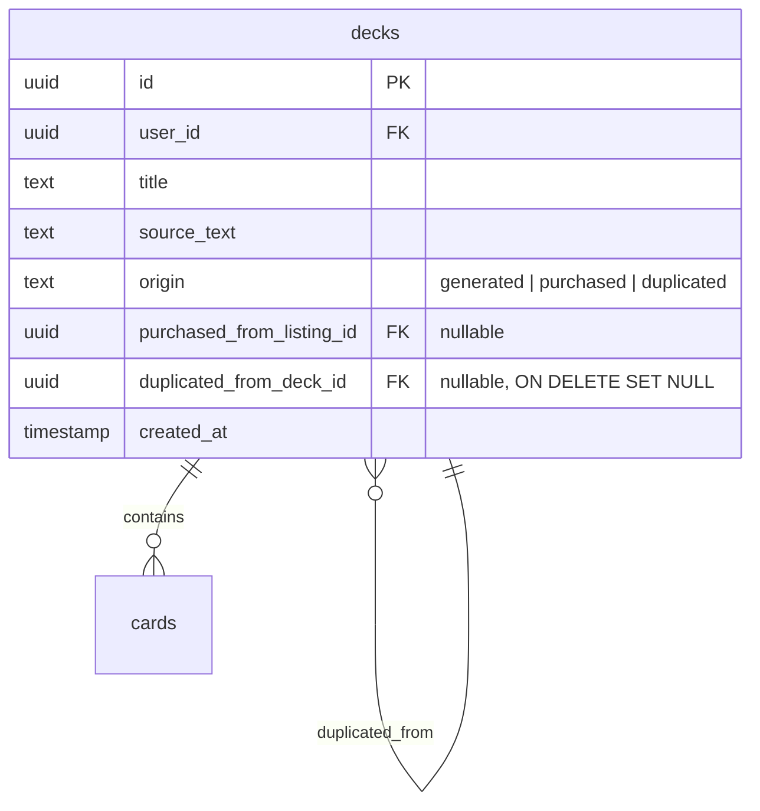

# UX Polish & Retention

## Enhancement Summary

**Deepened on:** 2026-03-14
**Technical review:** 2026-03-14 — 9 agents (architecture-strategist, security-sentinel, performance-oracle, data-integrity-guardian, data-migration-expert, julik-frontend-races-reviewer, code-simplicity-reviewer, pattern-recognition-specialist, kieran-typescript-reviewer)
**Research agents used:** best-practices-researcher (PostHog), best-practices-researcher (onboarding UX)

### Fixes Applied from Deepening (Round 1)

1. **Migration showstopper** — constraint name `decks_origin_check` is assumed but may differ. Use catalog-based dynamic drop (migration 011 pattern). Also split into 013 + 014 with `NOT VALID` + `VALIDATE CONSTRAINT`.
2. **Missing origin guard on `PATCH /api/decks/:id`** — plan blocks title editing on frontend but not server-side. Must add server guard.
3. **Onboarding step 2 race condition** — in-flight generation must be aborted on Skip/Back/unmount. Copy AbortController pattern from Generate.jsx.
4. **PostHog init must defer until consent** — plan contradicts its own NFR by initializing then opting out. Don't init until consent granted.
5. **Server analytics must extract to `services/analytics.js`** — exporting from `index.js` creates circular imports.
6. **Onboarding redirect needs `deck_count` in `/auth/me` response** — can't fetch deck list in ProtectedRoute on every render.
7. **API client uses `request`, not `fetchAPI`** — wrong function name in plan.
8. **Duplicate button needs double-click guard** — ref-based guard like Generate.jsx's savingRef.
9. **Title truncation** — appending " (Copy)" can exceed 200-char limit. Truncate first.

### Fixes Applied from Technical Review (Round 2)

10. **Onboarding redirect loop** — `/welcome` is inside ProtectedRoute, creating infinite redirect. Add `skipOnboardingCheck` prop.
11. **Missing `requireActiveUser`** — duplicate endpoint + 6 existing mutation endpoints lack suspended-user check. Add to all.
12. **Drop `@posthog/react`** — static import defeats deferred loading (~50KB in initial bundle). analytics.js is sole PostHog owner.
13. **Server-side analytics ignores consent** — `trackServerEvent` must check user's `analytics_opt_out` preference (GDPR).
14. **Empty deck duplication SQL error** — bulk INSERT with 0 cards produces invalid SQL. Guard with `sourceCards.length > 0`.
15. **PostHog identity replay after consent** — user logged in before consent → identify never called. Replay after `opt_in_capturing()`.
16. **`initPostHog()` double-init race** — cache the promise (not the result) to prevent concurrent `import()` calls.
17. **`deck_count` as correlated subquery** — separate COUNT query doubles DB round-trips on every `/auth/me` call. Use subquery instead.
18. **`deck_count` response shape** — return as sibling field `{ user, daily_generation_limit, deck_count }`, not inside sanitizeUser.
19. **One-way latch rejects entire payload** — `onboarding_completed: false` should be silently ignored, not reject sibling preferences.
20. **Preferences read-modify-write race** — wrap in transaction with `FOR UPDATE` to prevent concurrent clobber.
21. **Duplicate button AbortController** — `navigate()` after unmount on user back-navigation. Add AbortController + signal.
22. **Consent state sync on login** — server preference → localStorage on `/me` response to prevent banner re-appearing on other devices.
23. **Settings toggle: localStorage after API** — don't update localStorage until API call succeeds (server is source of truth).
24. **Remove 1.5s minimum timer** — race condition factory, excessive delay. Use same loading pattern as Generate.jsx.
25. **Duplicate title sanitization** — apply striptags, trim, non-empty check, Unicode-safe truncation via `Array.from()`.
26. **Migration LIKE filter tightened** — add `AND ... LIKE '%generated%'` to prevent matching unintended future constraints.
27. **Rollback instructions completed** — add `schema_migrations` cleanup, NOT VALID in rollback, verification query for existing rows.
28. **Post-deploy verification queries** — SQL to confirm constraint, column, FK, index, and data integrity after migration.
29. **Extract `useAsyncGuard` hook** — ref-based guard pattern used in 3+ places; extract to shared hook.
30. **Dev logging in analytics catch blocks** — `console.warn` in development mode for debuggability.
31. **Normalize COUNT query pattern** — use `COUNT(*)::int AS count` everywhere; extract shared deck limit helper.
32. **SIGTERM handler with timeout + server drain** — prevent process hang on PostHog flush failure; drain HTTP server.

## Overview

Three features to improve retention and product intelligence: deck duplication (with purchased deck editing restrictions), a guided onboarding flow that drives activation, and PostHog analytics integration. These build on top of the already-completed card editing and keyboard shortcuts work.

**Brainstorm:** `docs/brainstorms/2026-03-14-ux-polish-and-retention-brainstorm.md`

## Problem Statement

1. **No deck duplication** — users can't copy decks to create subsets, variations, or editable copies of purchased content. The only option is regenerating from scratch.
2. **No editing on purchased decks** — users who buy a deck and find a typo or want to personalize it are stuck. No explanation is given, no workaround is offered.
3. **Weak onboarding** — Welcome.jsx collects a display name and drops users on an empty dashboard. No guidance, no activation step, no tour. First-time users don't know what to do.
4. **Zero analytics** — every product decision is a guess. We don't know activation rates, popular study modes, marketplace conversion, or where users drop off.

## Proposed Solution

### Feature 1: Deck Duplication

New endpoint `POST /api/decks/:id/duplicate` that copies a deck and all its cards. Introduces `origin = 'duplicated'` as a distinct deck type that cannot be sold on the marketplace. Adds `duplicated_from_deck_id` for provenance tracking.

Purchased deck editing is blocked with a clear explanation and a one-click "Duplicate & Edit" action.

### Feature 2: Guided Onboarding

Replace Welcome.jsx with a 3-step flow: (1) display name, (2) generate your first deck, (3) quick tour. Step 2 is the critical activation moment — users who generate a deck are hooked. Reuses existing generation infrastructure.

### Feature 3: Analytics (PostHog)

Client-side `posthog-js` + server-side `posthog-node` with ~18 key events across activation, engagement, marketplace, seller, and revenue funnels. Consent banner, opt-out toggle in Settings, no PII in events.

## Technical Approach

### Architecture

No new services or major infrastructure. All three features layer onto existing patterns:

- **Duplication** follows the `fulfillPurchase` transaction pattern (`purchase.js:111-198`) but uses the bulk INSERT pattern from `decks.js:134-145` for cards (more efficient than the individual-INSERT loop in purchase.js)
- **Onboarding** reuses `api.generatePreview()` + `api.saveDeck()` — no new backend endpoints for generation
- **Analytics** — server-side PostHog goes in a new `server/src/services/analytics.js` (not `index.js`, to avoid circular imports). Client-side defers initialization until consent is granted via dynamic `import()`.

### Key Design Decisions

| Decision | Choice | Reasoning |
|----------|--------|-----------|
| Duplicated deck origin | `'duplicated'` (not `'generated'`) | Prevents selling duplicated content; seller.js line 36 already gates on `origin = 'generated'`. Correct over a boolean — the origin column is already the discriminator used throughout the codebase. |
| `duplicated_from_deck_id` FK | `ON DELETE SET NULL` | Source deck may be deleted or belong to another user (purchased deck scenario); SET NULL preserves the duplicate while accepting provenance loss |
| Duplicated decks count toward free tier limit | Yes — `origin IN ('generated', 'duplicated')` | Prevents free users from bypassing the 10-deck limit via infinite duplication |
| Can duplicate a duplicate | Yes | Duplicates are fully owned decks for all operations except selling |
| Copy `source_text` on duplication | Copy unconditionally | Purchased decks already have `source_text = NULL`, so copying NULL is a no-op. No conditional branch needed. |
| Purchased deck editing | Blocked (all mutations: title, card add/edit/delete) — **server-side + frontend** | Frontend-only blocking is insufficient — API calls could bypass it. Origin guard on `PATCH /:id` (rename), `POST /:id/cards`, `PATCH /:deckId/cards/:cardId`, `DELETE /:deckId/cards/:cardId` |
| Duplicate title format | `"[Original Title] (Copy)"` — striptags + trim + Unicode-safe truncation to 193 chars via `Array.from()` | Standard UX convention. Defense-in-depth against HTML in titles. `Array.from` avoids splitting emoji/CJK surrogate pairs. |
| Duplicate rate limit | Same as deck save (20/hour) via `saveLimiter` | Prevents abuse |
| Onboarding detection | `!user.preferences?.onboarding_completed && user.deck_count === 0` | Uses `deck_count` from `/auth/me` response (correlated subquery, no extra round-trip). Avoids disrupting existing users. `/welcome` route uses `skipOnboardingCheck` prop on ProtectedRoute to prevent infinite redirect loop. |
| Onboarding step persistence | Only set `onboarding_completed` at end | Simple — users who leave mid-flow see it again next login |
| Step 2 generation | Single topic text field, auto-title, no photos | Reduces cognitive load for first-time users |
| Step 2 counts toward daily limit | Yes | Same endpoints enforce limits naturally |
| Analytics opt-out | `analytics_opt_out` preference + Settings toggle + consent banner | GDPR/CCPA compliance. Server preference is source of truth; synced to localStorage on login for cross-device consistency. Settings toggle updates localStorage only AFTER successful API call. |
| Consent default | Missing `analytics_opt_out` in preferences = not consented | GDPR-safe default. New users see consent banner; existing users without the preference are not tracked. |
| Consent banner | PostHog not initialized until consent granted | GDPR: deferred init via dynamic `import()`. Consent handler replays `identify()` after `opt_in_capturing()` since user may already be logged in. |
| PostHog single owner | `analytics.js` owns PostHog instance exclusively | No `@posthog/react`, no `PostHogProvider`, no `setPostHogInstance` handoff. `initPostHog()` caches the promise (not result) to prevent double-init on StrictMode/double-click. |
| PostHog server-side deduplication | Fire events only after idempotency check passes | Prevents webhook replays from inflating metrics |
| PostHog server-side consent | `trackServerEvent` checks user's `analytics_opt_out` preference | GDPR: server-side events associated with a distinct user ID require the same consent as client-side. |
| PostHog error handling | All calls wrapped in try/catch with `console.warn` in dev, silent in prod | Analytics must not break core functionality. Dev logging aids debugging. |
| Server analytics module | `server/src/services/analytics.js` (not `index.js`) | Follows existing service pattern (purchase.js, email.js, stripe.js). Avoids circular imports since index.js imports routes and routes would import from index.js. |
| Preferences race condition | Read-modify-write wrapped in transaction with `FOR UPDATE` | Prevents concurrent preference updates (consent banner + onboarding completion) from clobbering each other. |

### ERD Changes



### Implementation Phases

#### Phase 1: Deck Duplication (Backend + Migration + Frontend)

**Migration `013_deck_duplication.sql`:**

```sql
-- 1. Drop existing origin CHECK by catalog lookup (name may differ from assumed)
-- This pattern is from migration 011 — never assume auto-generated constraint names
-- LIKE filter tightened with '%generated%' to avoid matching unintended future constraints
DO $$
DECLARE
  cname TEXT;
BEGIN
  FOR cname IN
    SELECT con.conname
    FROM pg_constraint con
    WHERE con.conrelid = 'decks'::regclass
      AND con.contype = 'c'
      AND pg_get_constraintdef(con.oid) LIKE '%origin%'
      AND pg_get_constraintdef(con.oid) LIKE '%generated%'
  LOOP
    EXECUTE format('ALTER TABLE decks DROP CONSTRAINT %I', cname);
  END LOOP;
END $$;

-- 2. Add updated constraint (NOT VALID — instant, no table scan, no ACCESS EXCLUSIVE hold)
ALTER TABLE decks ADD CONSTRAINT decks_origin_check
  CHECK (origin IN ('generated', 'purchased', 'duplicated')) NOT VALID;

-- 3. Provenance column
ALTER TABLE decks ADD COLUMN IF NOT EXISTS duplicated_from_deck_id UUID
  REFERENCES decks(id) ON DELETE SET NULL;

-- 4. Index for FK cascade performance (every FK column in this codebase has an index)
CREATE INDEX IF NOT EXISTS idx_decks_duplicated_from
  ON decks (duplicated_from_deck_id) WHERE duplicated_from_deck_id IS NOT NULL;

-- ROLLBACK (manual):
-- Step 1: Check for existing duplicated rows
--   SELECT COUNT(*) FROM decks WHERE origin = 'duplicated';
--   If > 0, decide: convert to 'generated' (lossy provenance) or abort rollback
-- Step 2: Convert any duplicated rows
--   UPDATE decks SET origin = 'generated', duplicated_from_deck_id = NULL WHERE origin = 'duplicated';
-- Step 3: Remove schema objects
--   DROP INDEX IF EXISTS idx_decks_duplicated_from;
--   ALTER TABLE decks DROP COLUMN IF EXISTS duplicated_from_deck_id;
--   ALTER TABLE decks DROP CONSTRAINT decks_origin_check;
--   ALTER TABLE decks ADD CONSTRAINT decks_origin_check
--     CHECK (origin IN ('generated', 'purchased')) NOT VALID;
--   ALTER TABLE decks VALIDATE CONSTRAINT decks_origin_check;
-- Step 4: Clean up migration tracking
--   DELETE FROM schema_migrations WHERE version IN (13, 14);
```

**Migration `014_validate_deck_constraints.sql`:**

```sql
-- Validate NOT VALID constraint from 013
-- SHARE UPDATE EXCLUSIVE lock — allows concurrent reads and writes
ALTER TABLE decks VALIDATE CONSTRAINT decks_origin_check;
```

**Post-deploy verification queries** (run after both migrations complete):

```sql
-- 1. Confirm constraint exists and is VALID
SELECT conname, convalidated, pg_get_constraintdef(oid)
FROM pg_constraint WHERE conrelid = 'decks'::regclass AND contype = 'c';
-- Expected: decks_origin_check, convalidated = true

-- 2. Confirm new column exists
SELECT column_name, data_type, is_nullable
FROM information_schema.columns
WHERE table_name = 'decks' AND column_name = 'duplicated_from_deck_id';

-- 3. Confirm FK exists
SELECT conname, pg_get_constraintdef(oid)
FROM pg_constraint WHERE conrelid = 'decks'::regclass AND contype = 'f'
  AND conname LIKE '%duplicated%';

-- 4. Confirm partial index exists
SELECT indexname, indexdef FROM pg_indexes
WHERE tablename = 'decks' AND indexname = 'idx_decks_duplicated_from';

-- 5. Confirm no duplicate origin constraints (old one should be gone)
SELECT conname FROM pg_constraint
WHERE conrelid = 'decks'::regclass AND contype = 'c'
  AND pg_get_constraintdef(oid) LIKE '%origin%';
-- Expected: exactly 1 row (decks_origin_check)
```

**New endpoint in `server/src/routes/decks.js`:**

`POST /api/decks/:id/duplicate`

```js
// Middleware: requireXHR, authenticate, requireActiveUser, checkTrialExpiry, saveLimiter
//
// 1. Verify deck ownership: SELECT ... WHERE id = $1 AND user_id = $2
//    CRITICAL: query MUST include AND user_id = $2 to prevent IDOR
//    (do NOT copy purchase.js's source read which omits ownership check)
//
// 2. Check deck limits: use shared deckLimitCount() helper (see below)
//
// 3. Read source cards OUTSIDE transaction (follows purchase.js pattern — avoids lock contention)
//
// 4. Sanitize title:
//    const striptags = require('striptags');
//    let title = striptags(sourceDeck.title).trim();
//    if (!title) title = 'Untitled';
//    // Unicode-safe truncation — Array.from avoids splitting emoji/CJK surrogate pairs
//    const chars = Array.from(title);
//    if (chars.length > 193) title = chars.slice(0, 193).join('');
//    title += ' (Copy)';
//
// 5. Transaction (pool.connect → BEGIN → writes → COMMIT → finally release):
//    a. INSERT deck with origin='duplicated', duplicated_from_deck_id=source.id
//    b. Guard empty decks: if (sourceCards.length > 0) { bulk INSERT cards }
//       Uses multi-row VALUES pattern from decks.js:134-145
//       (NOT the individual-INSERT loop from purchase.js — more efficient on 12-connection pool)
//    c. Copy source_text unconditionally (NULL for purchased decks is a no-op)
//
// 6. Handle FK violation (error code 23503) → 404 "Source deck no longer exists"
//
// 7. Return new deck with id for redirect
```

**Extract shared deck limit helper** to prevent query divergence across 3 locations:

```js
// server/src/db/queries.js (new)
// Shared helper — normalized COUNT pattern with ::int cast everywhere
export async function countUserDecks(pool, userId) {
  const { rows } = await pool.query(
    "SELECT COUNT(*)::int AS count FROM decks WHERE user_id = $1 AND origin IN ('generated', 'duplicated')",
    [userId]
  );
  return rows[0].count;
}
```

Replace inline COUNT queries in all 3 locations:
- `server/src/routes/decks.js:112` — replace inline query with `countUserDecks(pool, req.userId)`
- `server/src/middleware/plan.js:92` — replace inline query + `parseInt` with `countUserDecks(pool, req.userId)`
- New duplicate endpoint — uses same helper

**Add server-side origin guard on ALL mutation endpoints:**

- `PATCH /api/decks/:id` (rename, line 165) — reject if `origin = 'purchased'`
- `POST /api/decks/:id/cards` — reject if `origin = 'purchased'`
- `PATCH /api/decks/:deckId/cards/:cardId` — reject if deck `origin = 'purchased'`
- `DELETE /api/decks/:deckId/cards/:cardId` — reject if deck `origin = 'purchased'`

Error response: `{ error: 'purchased_deck_readonly', message: 'Purchased decks cannot be edited. Duplicate the deck to create an editable copy.' }`

This follows Format B error responses (structured `error` code + `message`) used in `seller.js` and `plan.js` where the client needs to perform programmatic actions based on the code. The client error handler at `api.js:17` prefers `data.message` for display and `err.data.error` for programmatic handling.

**Add `requireActiveUser` to ALL deck/card mutation endpoints** — pre-existing gap where suspended/soft-deleted users can mutate content:

- **New:** `POST /api/decks/:id/duplicate` (included in middleware chain above)
- **Existing:** `PATCH /api/decks/:id` (rename, line 165)
- **Existing:** `DELETE /api/decks/:id` (delete, line 189)
- **Existing:** `POST /api/decks/:id/cards` (add card, line 206)
- **Existing:** `PATCH /api/decks/:deckId/cards/:cardId` (edit card, line 237)
- **Existing:** `DELETE /api/decks/:deckId/cards/:cardId` (delete card, line 266)

Also add `striptags()` to the existing `PATCH /:id` rename endpoint for consistency with the save endpoint.

**Add `deck_count` to `/auth/me` response** (`server/src/routes/auth.js`):

Use a correlated subquery in the existing user SELECT — no separate query, no extra DB round-trip:

```sql
SELECT ${USER_SELECT},
  (SELECT COUNT(*)::int FROM decks WHERE user_id = users.id) AS deck_count
FROM users WHERE id = $1 AND deleted_at IS NULL
```

Return as a **sibling field** (like `daily_generation_limit` at line 175), NOT inside `sanitizeUser`:

```js
res.json({
  user: sanitizeUser(row),
  daily_generation_limit: limits.generationsPerDay,
  deck_count: row.deck_count   // sibling field, not in sanitizeUser
});
```

In `AuthContext.jsx`, expose `deck_count` on the user context object so ProtectedRoute can access it:
```js
setUser({ ...sanitizedUser, deck_count: data.deck_count });
```

Also sync server consent preference to localStorage on login (cross-device consistency):
```js
if (data.user?.preferences?.analytics_opt_out === false) {
  localStorage.setItem('analytics_consent', 'granted');
} else if (data.user?.preferences?.analytics_opt_out === true) {
  localStorage.setItem('analytics_consent', 'declined');
}
// If absent: leave localStorage as-is (show banner for new users)
```

**New API client method in `client/src/lib/api.js`:**

```js
duplicateDeck: (id, options = {}) => request(`/decks/${id}/duplicate`, { method: 'POST', ...options }),
```

Note: the function is named `request`, not `fetchAPI`. The `options` parameter allows passing `{ signal }` for AbortController cancellation.

**DeckView.jsx changes:**

1. **Duplicate button** — next to Delete, small icon (two overlapping squares). Uses `useAsyncGuard` hook (shared, extracted from the ref-based pattern in Generate.jsx) + AbortController for unmount safety:

   **Shared hook `client/src/hooks/useAsyncGuard.js` (new):**
   ```js
   import { useRef, useCallback } from 'react';
   export function useAsyncGuard() {
     const busyRef = useRef(false);
     const run = useCallback(async (fn) => {
       if (busyRef.current) return;
       busyRef.current = true;
       try { return await fn(); }
       finally { busyRef.current = false; }
     }, []);
     return { busy: busyRef, run };
   }
   ```

   **Duplicate handler with AbortController:**
   ```js
   const { run: guardedRun } = useAsyncGuard();
   const controllerRef = useRef(null);
   useEffect(() => () => controllerRef.current?.abort(), []);

   const handleDuplicate = () => guardedRun(async () => {
     const controller = new AbortController();
     controllerRef.current = controller;
     try {
       const data = await api.duplicateDeck(id, { signal: controller.signal });
       if (controller.signal.aborted) return;
       navigate(`/decks/${data.deck.id}`);
     } catch (err) {
       if (err.name === 'AbortError') return;
       toast.error(err.message);
     }
   });
   ```
   Also disable the button visually while in progress (separate state boolean).

2. **Purchased deck editing block** — when `deck.origin === 'purchased'`:
   - Hide all edit/add/delete buttons (pencil icons, add card form, delete buttons)
   - Hide inline title editing
   - Show a banner at the top: "This deck was purchased — it's read-only to preserve the original content."
   - Show a "Duplicate & Edit" button in the banner — same ref guard + AbortController as duplicate. Check component is still mounted before calling `navigate()` (use cleanup ref or abort signal).

3. **Duplicated deck badge** — show "Duplicated" origin badge. Use a distinct color from "Purchased" (e.g., neutral gray/slate) to avoid visual conflation.

**Dashboard.jsx changes:**

1. **`getDeckSellState` function** (line 76-85) — add case BEFORE the `!isSeller` check (line 81), so sellers see the disabled state:
   ```js
   if (deck.origin === 'duplicated') return 'disabled-duplicated';
   ```

2. **SellIcon component** (lines 87-123) — add `'disabled-duplicated'` state: grayed-out icon with tooltip: "Duplicated decks can't be sold. Only decks you generate from scratch are eligible for the marketplace."

3. **Deck count display** (line 262) — no change needed. Existing filter `d.origin !== 'purchased'` already includes duplicated decks.

4. **Origin badge** — add "Duplicated" badge alongside existing "Purchased" badge

**Files modified:**
- `server/src/db/migrations/013_deck_duplication.sql` (new)
- `server/src/db/migrations/014_validate_deck_constraints.sql` (new)
- `server/src/db/queries.js` (new) — shared `countUserDecks` helper
- `server/src/routes/decks.js` — duplicate endpoint, origin guards on ALL mutations (including rename), `requireActiveUser` on all mutation endpoints, `striptags()` on rename, use shared deck limit helper
- `server/src/routes/auth.js` — add `deck_count` as correlated subquery to `/me` response
- `server/src/middleware/plan.js` — use shared deck limit helper
- `client/src/hooks/useAsyncGuard.js` (new) — shared ref-based double-click guard hook
- `client/src/lib/api.js` — `duplicateDeck` method with options/signal parameter
- `client/src/pages/DeckView.jsx` — duplicate button with AbortController, purchased deck block, duplicated badge
- `client/src/pages/Dashboard.jsx` — sell icon state, origin badge

#### Phase 2: Guided Onboarding

**Welcome.jsx rewrite** — 3-step flow with local state (`useState` for step tracking):

**Step 1 — Welcome + Name:**
- Display name input, pre-filled from Google auth if available
- Continue button (calls `api.updateProfile`, then advances to step 2)
- Same styling as current Welcome page

**Step 2 — Generate Your First Deck:**
- Heading: "Let's create your first flashcards"
- Single text input: "What are you studying?" with placeholder examples (e.g., "Spanish vocabulary", "Biology cell structure", "JavaScript promises")
- Quick-start suggestion buttons (3-4 popular topics) to reduce blank-field paralysis
- "Generate" button — calls `api.generatePreview(topic, topic)` (topic as both input and title)
- **AbortController pattern** (CRITICAL — copy from Generate.jsx:24-43):
  - Create controller ref, abort on unmount and step transitions
  - Guard `saveDeck` call: `if (controller.signal.aborted) return;`
  - Skip/Back buttons must abort the controller BEFORE navigating
  - This prevents phantom decks from being saved after the user navigates away
- Loading state with progress indicator (same pattern as Generate.jsx — no artificial minimum delay)
- On success: auto-save via `api.saveDeck()`, advance to step 3
- On failure: **inline error state** (not just a toast) — "We hit a snag. This usually works on the second try." Primary: "Try Again". Secondary: "Try a different topic" (back to input). Tertiary: "Skip and explore on your own."
- "I'll do this later" skip link (aborts any in-flight generation)
- Back arrow to return to step 1 (aborts any in-flight generation)

**Step 3 — Quick Tour:**
- Heading: "Here's what you can do"
- 3 feature cards (simple divs with icon + heading + one-liner):
  1. Study modes — "Flip, multiple choice, type, and match"
  2. AI generation — "Paste notes or type a topic to generate cards"
  3. Marketplace — "Buy and sell decks from other students"
- If deck was generated: "Start studying" primary button → `/study/:deckId`
- If skipped generation: "Go to Dashboard" primary button → `/dashboard`
- Both buttons set `onboarding_completed: true` in preferences via `api.updatePreferences()`
- Back arrow to return to step 2

**Onboarding redirect logic in `App.jsx`:**

Add `skipOnboardingCheck` prop to ProtectedRoute to prevent infinite redirect loop (since `/welcome` is itself wrapped in ProtectedRoute):

```jsx
function ProtectedRoute({ children, skipOnboardingCheck = false }) {
  // ... existing auth check ...
  if (!skipOnboardingCheck && !user.preferences?.onboarding_completed && user.deck_count === 0) {
    return <Navigate to="/welcome" />;
  }
  return children;
}

// In routes — /welcome uses skipOnboardingCheck to break the loop:
<Route path="/welcome" element={
  <ProtectedRoute skipOnboardingCheck><Welcome /></ProtectedRoute>
} />
```

This is a synchronous check on the user object — no extra API call, no loading flash.

**Settings preferences allowlist update** (`server/src/routes/settings.js`):

Add to `validatePreferences` with explicit boolean validation:
```js
if ('onboarding_completed' in input) {
  // One-way latch: silently ignore non-true values (don't reject the entire payload)
  if (input.onboarding_completed === true) {
    clean.onboarding_completed = true;
  }
}
if ('analytics_opt_out' in input) {
  if (typeof input.analytics_opt_out !== 'boolean') return null;
  clean.analytics_opt_out = input.analytics_opt_out;
}
```

`onboarding_completed` is a one-way latch — users can set it to `true` but never reset to `false`. Invalid values (`false`, strings, etc.) are silently ignored rather than rejecting the entire preferences payload, so sibling preference changes (like `analytics_opt_out`) are not lost.

**Also wrap the preferences read-modify-write in a transaction with `FOR UPDATE`** to prevent concurrent updates (e.g., consent banner + onboarding completion firing together) from clobbering each other:

```js
const client = await pool.connect();
try {
  await client.query('BEGIN');
  const { rows: [current] } = await client.query(
    'SELECT preferences FROM users WHERE id = $1 FOR UPDATE', [req.userId]
  );
  const merged = deepMerge(current.preferences || {}, validated);
  await client.query(
    'UPDATE users SET preferences = $1 WHERE id = $2',
    [JSON.stringify(merged), req.userId]
  );
  await client.query('COMMIT');
  res.json({ preferences: merged });
} catch (err) {
  await client.query('ROLLBACK');
  throw err;
} finally {
  client.release();
}
```

**Files modified:**
- `client/src/pages/Welcome.jsx` — complete rewrite
- `client/src/App.jsx` — onboarding redirect logic with `skipOnboardingCheck` on ProtectedRoute
- `server/src/routes/settings.js` — preferences allowlist + `FOR UPDATE` transaction

#### Phase 3: Analytics Integration (PostHog)

**Installation:**
```bash
cd client && npm install posthog-js
cd server && npm install posthog-node
```

Note: `@posthog/react` is NOT installed. Statically importing it defeats the deferred loading strategy by pulling `posthog-js` (~50KB) into the initial bundle. The custom `analytics.js` wrapper is the sole PostHog interface — no `PostHogProvider`, no `usePostHog()` hook.

**Client initialization — `main.jsx` has NO PostHog code.**

PostHog is entirely owned by `analytics.js`. No static imports, no `PostHogProvider`, no module-level variables in `main.jsx`.

**Client analytics helper (`client/src/lib/analytics.js`) — single PostHog owner:**

This module owns initialization, instance management, consent checking, and all PostHog calls. The `initPostHog()` function caches the **promise** (not the result) to prevent double-init on StrictMode or double-click. Consent is cached in a module-scoped variable to avoid `localStorage.getItem()` on every call.

```js
let initPromise = null;
let posthog = null;
let consentGranted = typeof localStorage !== 'undefined'
  && localStorage.getItem('analytics_consent') === 'granted';

export function initPostHog() {
  if (initPromise) return initPromise;
  initPromise = import('posthog-js').then(({ default: ph }) => {
    ph.init(import.meta.env.VITE_POSTHOG_API_KEY, {
      api_host: 'https://us.i.posthog.com',
      defaults: '2026-01-30', // enables auto SPA pageview tracking via History API — verify against installed posthog-js version
      opt_out_capturing_by_default: true,
      person_profiles: 'identified_only',
    });
    posthog = ph;
    return ph;
  });
  return initPromise;
}

export function updateConsent(granted) {
  consentGranted = granted;
  localStorage.setItem('analytics_consent', granted ? 'granted' : 'declined');
}

function warn(err) {
  if (import.meta.env.DEV) console.warn('[analytics]', err);
}

export const analytics = {
  identify: (userId, properties) => {
    if (!consentGranted) return;
    try { posthog?.identify(userId, properties); } catch (e) { warn(e); }
  },
  reset: () => {
    try { posthog?.reset(); } catch (e) { warn(e); }
  },
  track: (event, properties) => {
    if (!consentGranted) return;
    try { posthog?.capture(event, properties); } catch (e) { warn(e); }
  },
  optOut: () => {
    try { posthog?.opt_out_capturing(); } catch (e) { warn(e); }
  },
  optIn: () => {
    try { posthog?.opt_in_capturing(); } catch (e) { warn(e); }
  },
};
```

**Why this architecture:**
- **Single owner** — no `setPostHogInstance` handoff, no dual module-scoped variables, no fragile wiring
- **Promise caching** — `initPostHog()` called twice returns the same promise (matches `refreshUser` deduplication pattern in AuthContext.jsx)
- **Cached consent** — module-scoped `consentGranted` avoids `localStorage.getItem()` on every `track()`/`identify()` call; updated via `updateConsent()`
- **Dev logging** — `console.warn` in development mode aids debugging; silent in production
- **No `@posthog/react`** — static import would pull ~50KB into the initial bundle, defeating deferred loading

**Client identity calls (`client/src/lib/AuthContext.jsx`):**

Add `analytics.identify(user.id, { plan, signup_date, is_seller })` alongside existing `Sentry.setUser()` calls (lines 16, 25, 32, 42, 59). **Only pass plan, signup_date, is_seller** — never email or display_name.

Add `analytics.reset()` alongside `Sentry.setUser(null)` in logout (line 69).

**Consent banner component (`client/src/components/ConsentBanner.jsx`):**

Banner at bottom of page for first-time visitors. Only shown when `localStorage.getItem('analytics_consent')` is null. Component checks localStorage on mount (not just initial render) to handle re-mount after navigation.

Needs access to current user (via `useAuth` hook) to replay `identify()` after opt-in — the user may already be logged in when they click Accept:

```js
import { initPostHog, analytics, updateConsent } from '../lib/analytics';
import { useAuth } from '../lib/AuthContext';

const { user } = useAuth();

const handleAccept = () => {
  updateConsent(true); // synchronous: sets module cache + localStorage
  initPostHog().then((ph) => {
    ph.opt_in_capturing();
    // Replay identity — user was already logged in before consent
    if (user) {
      ph.identify(user.id, { plan: user.plan, signup_date: user.created_at, is_seller: !!user.seller_terms_accepted_at });
    }
  });
  // Sync to server AFTER localStorage (server is source of truth for cross-device, but localStorage gates tracking)
  api.updatePreferences({ analytics_opt_out: false }).catch(() => {}); // fire-and-forget
  setVisible(false);
};

const handleDecline = () => {
  updateConsent(false);
  api.updatePreferences({ analytics_opt_out: true }).catch(() => {}); // fire-and-forget
  setVisible(false);
};
```

**Settings opt-out toggle:**

Add analytics toggle in the Privacy section of Settings.jsx. Update localStorage only AFTER successful API call (server is source of truth):

```js
import { analytics, updateConsent } from '../lib/analytics';

const handleAnalyticsToggle = async (optOut) => {
  try {
    await api.updatePreferences({ analytics_opt_out: optOut });
    // Only update local state after server confirms
    updateConsent(!optOut);
    if (optOut) { analytics.optOut(); }
    else { analytics.optIn(); }
    toast.success(optOut ? 'Analytics disabled' : 'Analytics enabled');
  } catch (err) {
    toast.error('Failed to update preference');
  }
};
```

**Server-side analytics service (`server/src/services/analytics.js`):**

```js
import { PostHog } from 'posthog-node';
import pool from '../db/pool.js';

let client = null;

function getClient() {
  if (client) return client;
  if (!process.env.POSTHOG_API_KEY) return null;
  client = new PostHog(process.env.POSTHOG_API_KEY, {
    host: 'https://us.i.posthog.com',
    flushAt: 20,
    flushInterval: 10000,
  });
  client.on('error', (err) => console.error('[PostHog]', err));
  return client;
}

// GDPR: Check user's opt-out preference before sending any event
export async function trackServerEvent(userId, event, properties = {}) {
  const ph = getClient();
  if (!ph) return;
  try {
    // Check user's analytics consent (GDPR requirement)
    const { rows } = await pool.query(
      "SELECT preferences->>'analytics_opt_out' AS opted_out FROM users WHERE id = $1",
      [userId]
    );
    if (rows[0]?.opted_out === 'true') return;
    ph.capture({ distinctId: userId, event, properties });
  } catch (err) {
    if (process.env.NODE_ENV !== 'production') console.warn('[PostHog]', err);
  }
}

export async function shutdownAnalytics() {
  if (client) await client.shutdown();
}
```

Lazy-init pattern follows existing service conventions (not pool.js, which is eagerly initialized). Add graceful shutdown in `index.js` with timeout guard and server drain:

```js
import { shutdownAnalytics } from './services/analytics.js';

const server = app.listen(PORT, () => { /* ... */ });

process.on('SIGTERM', async () => {
  const timeout = setTimeout(() => process.exit(1), 5000); // prevent hang if flush stalls
  server.close();           // stop accepting new connections
  await shutdownAnalytics(); // flush batched PostHog events
  await pool.end();          // drain database connections
  clearTimeout(timeout);
  process.exit(0);
});
```

**Server-side event placement** — fire AFTER idempotency checks pass:

| Event | File | Location | Properties |
|-------|------|----------|------------|
| `signup_completed` | `auth.js:94` | After INSERT user | `method: 'email'` |
| `signup_completed` | `auth-google.js:125` | After INSERT user | `method: 'google'` |
| `signup_completed` | `auth-magic.js:143` | After INSERT user | `method: 'magic_link'` |
| `seller_terms_accepted` | `seller.js:355` | After UPDATE | — |
| `seller_onboarding_started` | `seller.js:410` | After account link created | — |
| `seller_onboarding_completed` | `seller.js:467` | After charges_enabled confirmed | — |
| `listing_created` | `seller.js:115` | After INSERT listing | `category_id, price_cents` |
| `purchase_completed` | `stripe.js:225` | After fulfillPurchase succeeds (inside isNew check) | `listing_id, price` |
| `subscription_started` | `stripe.js:142` | After checkout.session.completed | — |
| `subscription_cancelled` | `stripe.js:155` | After cancel_at_period_end detected | — |

**Client-side event placement:**

| Event | File | Location | Properties |
|-------|------|----------|------------|
| `onboarding_step_completed` | `Welcome.jsx` | After each step transition | `step: 1/2/3` |
| `first_deck_generated` | `Welcome.jsx` | After step 2 save succeeds | — |
| `deck_generated` | `Generate.jsx` | After save succeeds | `method: text/photo, card_count` |
| `deck_duplicated` | `DeckView.jsx` | After duplication succeeds | `source_origin: generated/purchased/duplicated` |
| `study_session_started` | `Study.jsx` | After mode selected and session created | `mode` |
| `study_session_completed` | `Study.jsx` | After results shown | `mode, accuracy, duration` |
| `marketplace_viewed` | `Marketplace.jsx` | On mount | — |
| `listing_viewed` | `MarketplaceDeck.jsx` | On mount | `listing_id` |
| `purchase_started` | `MarketplaceDeck.jsx` | On buy button click | `listing_id` |
| `streak_milestone` | `Dashboard.jsx` | When streak hits 7/30/100 | `days` |

**New env vars:**

| Variable | Where | Purpose |
|----------|-------|---------|
| `VITE_POSTHOG_API_KEY` | `client/.env` | PostHog project API key (client) |
| `POSTHOG_API_KEY` | `server/.env` | PostHog project API key (server) |

**Files modified:**
- `client/src/lib/analytics.js` (new) — single PostHog owner: init, consent, tracking wrapper
- `client/src/lib/AuthContext.jsx` — identify/reset calls, consent sync from server on login
- `client/src/components/ConsentBanner.jsx` (new) — with identity replay and useAuth hook
- `client/src/App.jsx` — render ConsentBanner
- `client/src/pages/Settings.jsx` — analytics opt-out toggle (localStorage after API success)
- `client/src/pages/Welcome.jsx` — onboarding events
- `client/src/pages/Generate.jsx` — deck_generated event
- `client/src/pages/DeckView.jsx` — deck_duplicated event
- `client/src/pages/Study.jsx` — session events
- `client/src/pages/Marketplace.jsx` — marketplace_viewed event
- `client/src/pages/MarketplaceDeck.jsx` — listing_viewed, purchase_started events
- `client/src/pages/Dashboard.jsx` — streak_milestone event
- `server/src/services/analytics.js` (new) — PostHog server init + consent-checking trackServerEvent
- `server/src/index.js` — graceful shutdown with timeout guard + server drain + pool.end
- `server/src/routes/auth.js` — signup_completed event
- `server/src/routes/auth-google.js` — signup_completed event
- `server/src/routes/auth-magic.js` — signup_completed event
- `server/src/routes/seller.js` — seller funnel events
- `server/src/routes/stripe.js` — purchase + subscription events
- `server/src/routes/settings.js` — analytics_opt_out preference allowlist, FOR UPDATE transaction

Note: `main.jsx` is NOT modified for PostHog — all PostHog code lives in `analytics.js`. No `@posthog/react`, no `PostHogProvider`.

## Acceptance Criteria

### Functional Requirements

- [x] `POST /api/decks/:id/duplicate` creates a new deck with `origin = 'duplicated'` and copies all cards
- [x] Duplicate endpoint query includes `AND user_id = $2` (IDOR prevention)
- [x] Duplicating a deck with zero cards succeeds (creates empty deck — no SQL error)
- [x] Duplicated decks have `duplicated_from_deck_id` set to source deck ID
- [x] Duplicated decks cannot be listed on the marketplace (server rejects, frontend shows disabled icon with tooltip)
- [x] Duplicated decks count toward free tier 10-deck limit (shared `countUserDecks` helper)
- [x] Duplicating a duplicate is allowed (recursive duplication works)
- [x] Duplicate title has striptags + trim + Unicode-safe truncation applied
- [x] Purchased deck cards cannot be edited/added/deleted (server rejects with explanatory error)
- [x] Purchased deck title cannot be renamed (server rejects `PATCH /api/decks/:id`)
- [x] DeckView shows "read-only" banner on purchased decks with "Duplicate & Edit" button
- [x] DeckView shows "Duplicate" button on all decks (next to Delete) with `useAsyncGuard` + AbortController
- [x] Navigating away mid-duplication does not cause phantom navigation (AbortController cleanup)
- [x] Dashboard shows disabled sell icon with explanation on duplicated decks
- [x] Dashboard shows "Duplicated" origin badge on duplicated deck cards
- [x] New users (no decks, onboarding not completed) are redirected to `/welcome`
- [x] `/welcome` route does NOT trigger onboarding redirect loop (uses `skipOnboardingCheck`)
- [x] Existing users with decks are NOT redirected to onboarding
- [x] Onboarding step 1 collects display name (pre-filled for Google users)
- [x] Onboarding step 2 generates a deck from a topic input (or can be skipped)
- [x] Onboarding step 2 aborts in-flight generation on Skip/Back/unmount (no phantom decks)
- [x] Onboarding step 3 shows a quick tour with 3 feature cards
- [x] Onboarding sets `onboarding_completed: true` in preferences on completion (one-way latch — silently ignores `false`)
- [x] `@posthog/react` is NOT installed — `analytics.js` is sole PostHog interface
- [x] PostHog client does not initialize until consent is granted (deferred dynamic import)
- [x] `initPostHog()` caches the promise to prevent double-init (StrictMode safe)
- [x] Consent banner replays `identify()` after `opt_in_capturing()` for already-logged-in users
- [x] PostHog identifies users on login (plan, signup_date, is_seller only — no PII), resets on logout
- [x] Server consent preference synced to localStorage on login (cross-device consistency)
- [x] All ~18 events fire at the correct locations (see event tables above)
- [x] Consent banner shown to first-time visitors, respects accept/decline
- [x] Settings opt-out toggle updates localStorage AFTER successful API call
- [x] Server-side `trackServerEvent` checks user's `analytics_opt_out` before sending (GDPR)
- [x] No PII in any PostHog event or person properties (no email, no name, no deck content)

### Non-Functional Requirements

- [x] Duplication endpoint is transactional (no partial copies) using bulk INSERT
- [x] Duplication endpoint has rate limiting (20/hour via `saveLimiter`)
- [x] All new state-changing endpoints have `requireXHR` CSRF protection
- [x] `requireActiveUser` on ALL deck/card mutation endpoints (duplicate, rename, delete, card add/edit/delete)
- [x] Preferences read-modify-write wrapped in transaction with `FOR UPDATE`
- [x] PostHog errors never crash the app — `try/catch` with `console.warn` in dev, silent in prod
- [x] PostHog server events only fire after idempotency checks pass AND user consent check (GDPR)
- [x] PostHog SDK does not load until consent is granted (dynamic import, not static)
- [x] No `@posthog/react` in bundle — sole interface is `analytics.js`
- [x] Server-side PostHog flushes on graceful shutdown (SIGTERM with 5s timeout + server drain + pool.end)
- [x] Migration uses catalog-based constraint drop with tightened LIKE filter
- [x] Migration uses NOT VALID + separate VALIDATE CONSTRAINT
- [x] Migration rollback instructions include `schema_migrations` cleanup
- [x] Post-deploy verification queries documented

## Success Metrics

- **Duplication:** Track `deck_duplicated` events — measure how often users duplicate purchased vs generated decks
- **Onboarding:** Measure activation rate (signup → first deck generated) via `onboarding_step_completed` funnel. Benchmark: 40-60% completion rate, time-to-first-deck under 5 minutes.
- **Analytics:** PostHog dashboard shows clean event data within 24 hours of deployment

## Dependencies & Prerequisites

- PostHog account created with project API key
- No blocking dependencies between features — can be built in any order
- Migrations 013 + 014 must run before duplication feature is usable

## Risk Analysis & Mitigation

| Risk | Likelihood | Impact | Mitigation |
|------|-----------|--------|------------|
| Free users bypass deck limits via duplication | High | Medium | Duplicated decks count toward limits (shared `countUserDecks` helper — single source of truth) |
| Users sell duplicated content | Medium | High | Server-side gate on `origin = 'generated'` already exists; frontend disabled icon adds UX layer |
| Onboarding AI generation fails for new user | Low | High | Inline error state with retry + topic change + skip options |
| Phantom deck from aborted onboarding generation | High | Medium | AbortController pattern from Generate.jsx; guard saveDeck with abort check |
| PostHog SDK increases bundle size | Low | Low | Dynamic import — only loaded after consent. No `@posthog/react` in bundle. |
| Webhook replays double-count analytics events | Medium | Medium | Fire events only after idempotency check passes |
| Existing users forced through onboarding | Medium | High | Detection checks `deck_count === 0` from `/auth/me` — existing users with decks are never redirected |
| Onboarding redirect loop on /welcome | High | Critical | `skipOnboardingCheck` prop on ProtectedRoute for /welcome route |
| Migration constraint name mismatch | High | Critical | Catalog-based dynamic drop with tightened LIKE filter (`%origin%` AND `%generated%`) |
| IDOR on duplicate endpoint | Medium | High | Source deck query MUST include `AND user_id = $2` |
| Double-click / navigate-away on duplicate | Medium | Medium | `useAsyncGuard` hook + AbortController + signal forwarding |
| PostHog identify fires before consent | Medium | Medium (GDPR) | Cached consent check + identity replay after late consent |
| Suspended users mutate content | Medium | High | `requireActiveUser` on ALL 7 deck/card mutation endpoints |
| Server-side events ignore user consent | Medium | High (GDPR) | `trackServerEvent` checks `analytics_opt_out` preference before sending |
| Concurrent preference updates clobber each other | Medium | Medium | `FOR UPDATE` transaction on preferences read-modify-write |
| Consent state diverges across devices | Medium | Low | Server preference synced to localStorage on login; server is source of truth |
| `initPostHog()` double-init on StrictMode | Medium | Low | Promise caching (matches refreshUser deduplication pattern) |
| Empty deck duplication SQL error | Low | Medium | Guard with `sourceCards.length > 0` before bulk INSERT |
| HTML in duplicate title (XSS-adjacent) | Low | Medium | `striptags()` + trim + non-empty check on duplicate title |

## References & Research

### Internal References

- Purchase fulfillment pattern (duplication template): `server/src/services/purchase.js:111-198`
- Bulk INSERT card pattern (preferred over loop): `server/src/routes/decks.js:134-145`
- Sentry init pattern (analytics template): `client/src/main.jsx:8-20`, `server/src/index.js:8-31`
- AbortController pattern (onboarding/duplication): `client/src/pages/Generate.jsx:24-43`
- Ref-based double-click guard: `client/src/pages/Generate.jsx:25` (`savingRef`)
- Deck sell state logic: `client/src/pages/Dashboard.jsx:76-85`
- Card mutation endpoints: `server/src/routes/decks.js:206-285`
- Deck rename endpoint (needs origin guard): `server/src/routes/decks.js:165`
- Preferences validation: `server/src/routes/settings.js:111-134`
- Deck limit check: `server/src/middleware/plan.js:91-101`
- Catalog-based constraint drop pattern: `server/src/db/migrations/011_content_moderation.sql:11-25`
- NOT VALID constraint pattern: `server/src/db/migrations/009_study_modes_and_streaks.sql`
- Auth event locations: `server/src/routes/auth.js:74-104`, `auth-google.js:65-125`, `auth-magic.js:122-147`
- Seller event locations: `server/src/routes/seller.js:335-477`
- Stripe event locations: `server/src/routes/stripe.js:22-256`

### Institutional Learnings (from `docs/solutions/`)

- **CSRF**: All state-changing endpoints must use `requireXHR` middleware
- **Soft-delete**: User queries must filter `deleted_at IS NULL`
- **Token revocation**: Queries used for auth decisions must include `token_revoked_at`
- **PII scrubbing**: Configure `beforeSend` to strip email, passwords, JWT tokens
- **Preferences JSONB**: Use allowlist validation in application code, not Postgres `||` shallow merge
- **Idempotent webhooks**: Use `ON CONFLICT DO NOTHING` pattern; fire analytics events only after confirming the action was new

### External Research

- PostHog JS SDK: `posthog-js` with dynamic `import()` for deferred loading (NOT `@posthog/react` — static import defeats deferred loading)
- PostHog `defaults: '2026-01-30'` enables automatic SPA pageview tracking via History API — verify against installed posthog-js version at implementation time
- PostHog `opt_out_capturing_by_default: true` for GDPR
- PostHog Node SDK requires `shutdown()` call on SIGTERM to flush batched events
- Onboarding activation benchmark: 25% increase in activation correlates with 34% rise in MRR over 12 months
- Onboarding completion rate benchmark: 40-60% average, 70%+ top performers
- Time-to-first-value target: under 5 minutes
